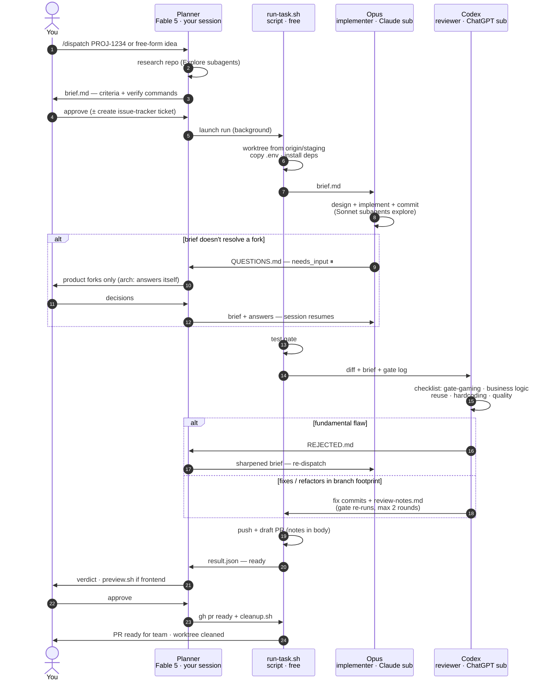
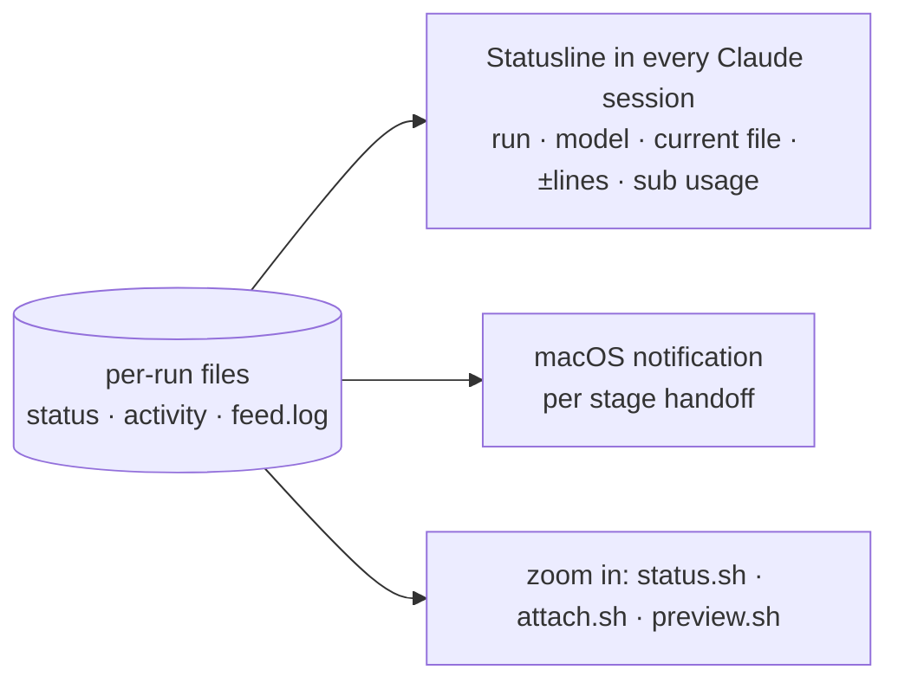

# Dispatch Harness — Flow

Multi-model pipeline: Planner researches and writes the brief (your session —
best results with Claude Fable 5; API credits or subscription) ·
Opus implements (Claude subscription) · Codex reviews (ChatGPT subscription) ·
deterministic gate + script glue (free).

## Main pipeline

## Monitoring (ambient — nothing to remember)

To print: paste a block into https://mermaid.live → Export PNG/SVG,
or open this file in VS Code (Markdown Preview Mermaid Support).
