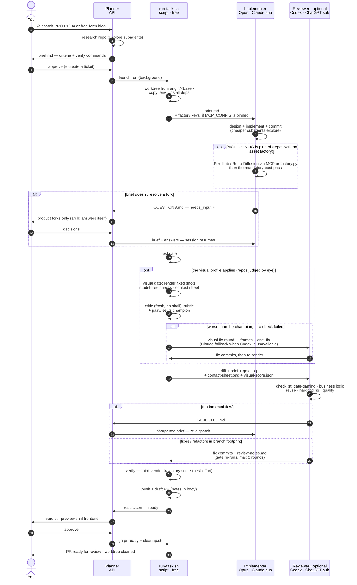
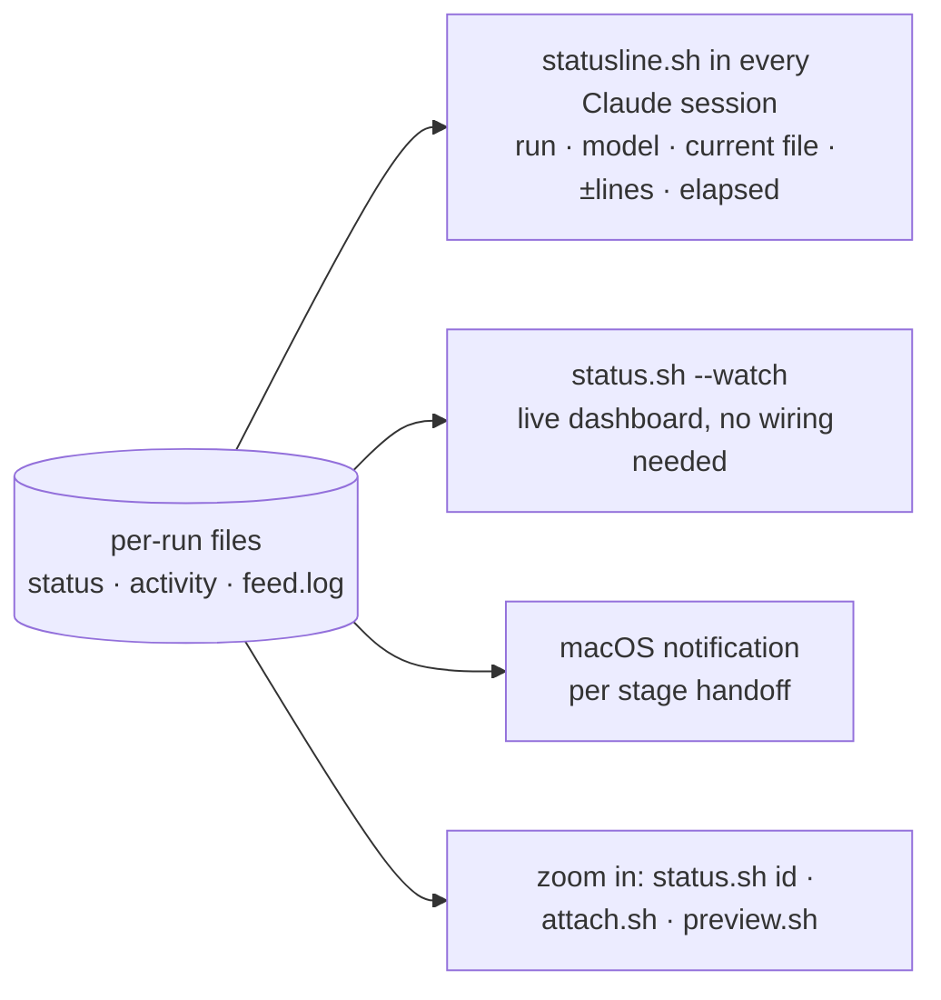

# Dispatch Harness — Flow

Multi-model pipeline: Planner researches and writes the brief (your session —
best results with Claude Fable 5; API credits or subscription) ·
Opus implements (Claude subscription) · Codex reviews (ChatGPT subscription —
optional, skipped when the `codex` CLI is absent) ·
deterministic gate + script glue (free).

## Main pipeline

The same block is inlined in [`README.md`](README.md); `tests/docs.test.sh`
asserts the two stay byte-identical.

## The visual gate (repos the visual profile applies to)

A stage between the test gate and the review, for work judged by eye. It renders
fixed shots headless, measures them without a model (palette, grid, luminance
floor, legibility, continuity, SSIM against the reigning champion), and then asks
one fresh critic — no shell, strict JSON schema — to grade a rubric and, the
verdict that decides the round, whether the challenger is **better or worse than
the champion**. Worse fails, however good the absolute scores are. A failure runs
a visual fix round on the normal fix backend (Codex when available, a fresh
Claude worker otherwise) and re-renders; when the rounds run out the run ends
`visual_failed` with the frames, the sheet and the critic's reasons, and no PR.
Champions are promoted by a human at milestones, never by the pipeline.

The profile applies to a repo that carries a `.creative/` contract or pins
`VISUAL_GATE_CMD`; for every other repo none of this exists. See
[Profiles](docs/reference.md#profiles) and
[`profiles/visual/creative/README.md`](profiles/visual/creative/README.md).

## The factory (repos that set `MCP_CONFIG`)

Not a stage — a set of hands the implementer has, and a rule about what it does
with them. Pinning `MCP_CONFIG` to
`profiles/visual/creative/factory.mcp.json` gives the worker the PixelLab and
Retro Diffusion MCP servers, and makes the visual profile source
`$HARNESS_DIR/factory.conf.sh` into **that process only**, through the same
`implementer_env` hook the GLM credential uses: the gate, the reviewer, the PR
stage and the live feed never see a key. Bulk work goes through
`profiles/visual/creative/factory.py` (frozen prompt templates, `seed =
sha256(id)`, a body-hash cache, a provenance manifest), and everything it
produces goes through `postpass.py` before it is an asset.

## Claude-only mode (no `codex` CLI)

Cross-vendor review is the optional part; a review is not. When `codex` is not
installed the run pins the `claude_only` arm and takes the review straight to
the last tier: the same review prompt in a fresh Claude session, the same
evidence check, and the same `review_failed` hold — no PR — if it produces
nothing. `result.json` records `review: reviewed_claude` and the model that
reviewed. Base-sync merge conflicts (PR mechanics, not quality review) are then
resolved by a Claude worker instead of Codex. The only arm that ships without a
review is `no_review` (`HARNESS_SKIP_REVIEW=1`), which asks for that baseline
on purpose.

## Monitoring (ambient — nothing to remember)

`statusline.sh` ships with the harness; `install.sh` offers to wire it into
`~/.claude/settings.json`, or append `statusline.sh --runs-only` to a statusline
you already have. `status.sh --watch` is the zero-config equivalent.

To print: paste a block into https://mermaid.live → Export PNG/SVG,
or open this file in VS Code (Markdown Preview Mermaid Support).
