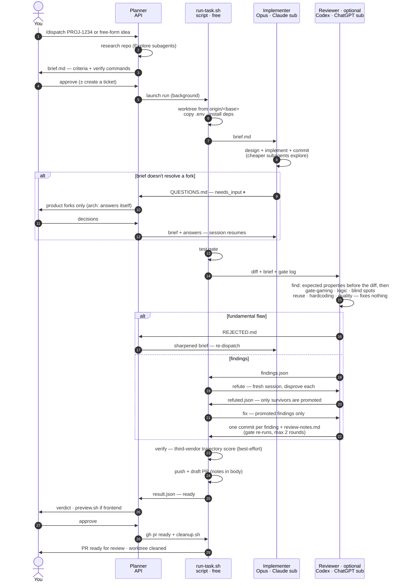
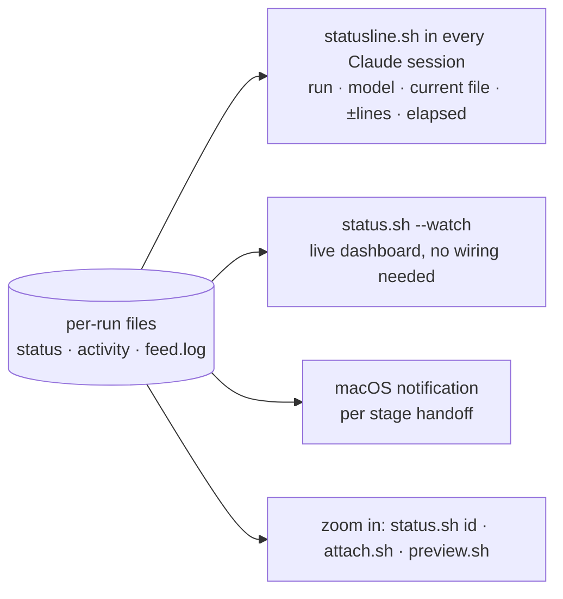

# Dispatch Harness — Flow

Multi-model pipeline: Planner researches and writes the brief (your session —
best results with Claude Fable 5; API credits or subscription) ·
Opus implements (Claude subscription) · Codex reviews (ChatGPT subscription —
optional, skipped when the `codex` CLI is absent) ·
deterministic gate + script glue (free).

## Main pipeline

The same block is inlined in [`README.md`](README.md); `tests/docs.test.sh`
asserts the two stay byte-identical.

## Claude-only mode (no `codex` CLI)

Cross-vendor review is the optional part; a review is not. When `codex` is not
installed the run pins the `claude_only` arm and takes the review straight to
the last tier: the same review prompt in a fresh Claude session, the same
evidence check, and the same `review_failed` hold — no PR — if it produces
nothing. `result.json` records `review: reviewed_claude` and the model that
reviewed. Base-sync merge conflicts (PR mechanics, not quality review) are then
resolved by a Claude worker instead of Codex. The only arm that ships without a
review is `no_review` (`HARNESS_SKIP_REVIEW=1`), which asks for that baseline
on purpose.

## Monitoring (ambient — nothing to remember)

`statusline.sh` ships with the harness; `install.sh` offers to wire it into
`~/.claude/settings.json`, or append `statusline.sh --runs-only` to a statusline
you already have. `status.sh --watch` is the zero-config equivalent.

To print: paste a block into https://mermaid.live → Export PNG/SVG,
or open this file in VS Code (Markdown Preview Mermaid Support).
