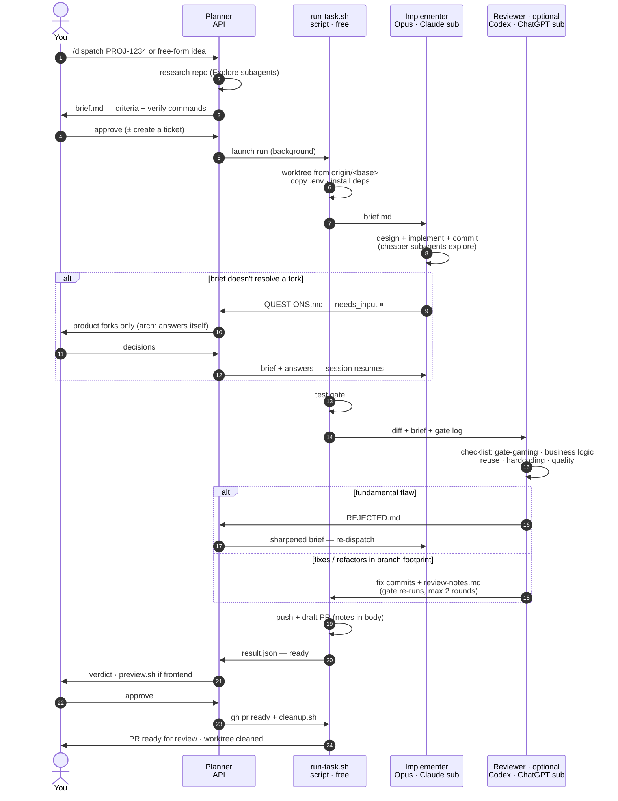

# Dispatch Harness

A multi-model pipeline for shipping code: **one model plans, a second
implements, a deterministic gate runs, a third — from a different vendor —
reviews and fixes, and a draft PR opens.** You approve at the ends; the middle
runs unattended in a git worktree.

The design principle is simple: **no model grades its own homework.** The agent
that writes the code is never the agent that reviews it, and they come from
different vendors (Anthropic and OpenAI), so a blind spot in one model's
training is unlikely to be shared by the other. Between them sits a gate no
model can talk its way past.

```
you → planner → [ implementer → gate → reviewer → gate ] → draft PR → you
  (your session)  (Claude sub)  (free)  (ChatGPT sub)
```

The planner isn't pinned by the harness: it is whatever Claude Code session
invokes `/dispatch`, billed however that session is billed — API credits or a
subscription. We've gotten the best results with **Claude Fable 5** as the
planner (sharper briefs up front mean fewer `needs_input` stops and review
fixes downstream); an Opus session on a Claude subscription also works, and
then the whole pipeline runs on flat-rate plans. Only the implementer and
reviewer are fixed by the pipeline.

---

## Why it's built this way

**Cross-vendor implement/review split.** The implementer (Anthropic's Opus —
`claude-opus-5` by default, via a Claude subscription) writes and commits. The
reviewer (OpenAI's Codex — `gpt-5.6-sol` by default, via a ChatGPT
subscription) reads the diff cold and fixes what it finds. Neither
sees the other's reasoning — only the committed result. A self-review by the
same model tends to rationalize its own choices; a different model from a
different lab does not. The reviewer is the one optional stage: without the
`codex` CLI the same pipeline runs in [Claude-only mode](#claude-only-mode).

**A deterministic gate between the models.** Between implement and review runs a
plain test gate — your repo's own `lint`/`type-check`/`test` commands, no model
in the loop. It is the objective checkpoint: green or red, no narrative. Because
a model *could* make the gate green by weakening the tests, the reviewer's
**first and highest-priority checklist item is anti-gate-gaming**: it hunts for
weakened or deleted tests, skipped cases, loosened assertions, hardcoded
expected values, and edited fixtures — and restores proper tests and fixes the
code instead. A green gate only counts if the tests earning it weren't touched.

**Subscription economics.** The expensive, low-volume work — research and the
brief — runs in your orchestrator session, billed however that session is
billed (in our experience Claude Fable 5 on API credits earns its price here;
a subscription session works too). The expensive, *high-volume* work —
implementing and reviewing, which burn the most tokens — runs on flat-rate
**subscriptions** (Claude and ChatGPT) that you already pay for. The glue between stages (worktrees, the gate, the PR)
is deterministic shell and costs nothing. You get frontier models on the
token-heavy stages without metered token bills for them.

**`needs_input`: stop, don't guess.** When the implementer hits a fork the brief
doesn't resolve — a genuine product or priority decision — it does **not**
guess. It writes the specific question(s) to `QUESTIONS.md` and stops the run
with status `needs_input`. Worker sessions are **resumable**: the planner (or
you) appends answers to the brief and re-dispatches the exact same command, and
the worker continues with its full context intact — it does not start over. You
can also step into the live session interactively at any time.

**Per-model commit attribution.** Every run records `opus_head` — the commit SHA
that marks the boundary between the implementer's work and the reviewer's fixes.
Commits up to it are the implementer's; commits after it are the reviewer's.
Attribution lives only in the run's metadata, never in the commit messages
themselves (the commits stay clean — no AI or agent mentions), so you always
know which model wrote what without polluting the history.

---

## Architecture

The full pipeline, stage by stage (source: [`FLOW.md`](FLOW.md); a printable
one-page version is in [`harness-flow.html`](harness-flow.html)):



Each run gets its own git worktree (`<repo>-<ticket>`), so multiple tickets run
in parallel without colliding. The brief and all metadata live in a
`.harness/` directory inside the worktree that is git-excluded — it never ships
in a commit or PR.

**Spec attachments.** When the real spec lives in an office document — a Word
feature spec, an Excel rules table, a PDF — the planner converts it to markdown
with [anydoc](https://github.com/firecrawl/anydoc) (`npx -y @firecrawl/anydoc
<file> -o <run-dir>/specs/<name>.md`: 14 formats, auto-detected, nothing to
install) and leaves it in the run dir. Everything under the run dir's `specs/`
is mounted at `.harness/specs/` in the worktree before the implementer starts,
and both workers are told to read it as part of the task contract — so the
detail the brief distils stays consultable instead of being paraphrased away.
When the run dir has a `specs/` directory, re-dispatching replaces the mounted
set wholesale with its current contents, so a revised spec never piles up next
to the version it supersedes. To withdraw every spec from a run in flight,
leave that directory present but empty; an absent source directory is a no-op.
The pipeline never runs `anydoc` itself; conversion is planner-side only.

---

## Prerequisites

Required:

- **[`claude`](https://docs.claude.com/en/docs/claude-code) CLI** — runs the
  implementer (and, if you like, the planner) on a Claude subscription.
- **`gh`** (GitHub CLI, authenticated) — pushes branches and opens PRs.
- **`jq`** — reads/writes run metadata.
- **`git`**, **`bash`**, and standard Unix tools: `curl`, `perl`, `lsof`,
  `uuidgen`. macOS ships all of these; on Linux install `uuid-runtime` (for
  `uuidgen`) and `lsof` if missing.

Optional, strongly recommended — it is the whole cross-vendor review stage:

- **`codex` CLI** (≥ 0.145) — runs the reviewer on a ChatGPT subscription.
  Older versions reject the default reviewer model (`gpt-5.6-sol`). Without it
  the harness runs in [Claude-only mode](#claude-only-mode).

Optional (only for `station.sh`, the parked orchestrator session you drive from
your phone):

- **`tmux`** — `station.sh` runs the session inside it. Nothing else in the
  harness needs tmux.

Optional (only for [`wall.sh`](#the-wall), the big-screen run dashboard):

- **`node`** (≥ 20) — runs the wall's zero-dependency HTTP server. Nothing else
  in the harness needs it.

Optional (only for the auto-recorded PR demo videos on frontend runs):

- **[`shot-scraper`](https://shot-scraper.datasette.io/)** — records the
  storyboard.
- **`python3`** — runs the interactive login capture when `shot-scraper` was
  installed outside uv's default tool directory.
- **[`rclone`](https://rclone.org/)** — uploads the video to object storage
  (any S3-compatible bucket: Cloudflare R2, AWS S3, Backblaze B2, MinIO).
- **`ffmpeg`** — transcodes the recording and builds the preview GIF.

Optional (only for the copyable Postgres preflight example): **`docker`** and
**`nc`**.

Optional (planner-side only, for [spec attachments](#architecture)): **`npx`**
with Node 20+ — converts document attachments to markdown via `npx -y
@firecrawl/anydoc`. Nothing in the pipeline itself invokes it.

Portability notes: the scripts target **bash 3.2** (the macOS default). macOS
ships no `timeout(1)`, so the harness uses a `perl -e 'alarm ...'` wrapper as a
process cap. The only hard macOS-specific dependency is `osascript` for local
desktop notifications — it is guarded, so on Linux notifications are simply
skipped (phone push via [ntfy](https://ntfy.sh) still works). CI
([`.github/workflows/gate.yml`](.github/workflows/gate.yml)) runs the gate on
Linux to keep the shipped scripts portable.

### Claude-only mode

Every run detects the `codex` CLI at startup, so one codebase serves both
setups — there is no separate install variant or flag:

- **codex present** — nothing changes: full arm, review and fix rounds, Codex
  resolves base-sync conflicts.
- **codex absent** — the run pins the `no_review` arm, emits a
  `review skipped — no codex CLI found (Claude-only mode)` stage line (visible
  in the statusline, timeline and notifications), and leaves `reviewer_model` /
  `reviewer_effort` empty in `result.json` rather than claiming a review that
  never ran. The review is skipped, not reassigned to a second Claude worker —
  no model grades its own homework. Base-sync conflict resolution (PR
  mechanics, not quality review) falls back to a Claude worker on your
  subscription — same prompt, fresh session, logged to `claude-<label>.log`.

Everything else is identical: worktree, deterministic gate, `needs_input`
escalation, PR, demo recording. Install `codex` later and the next dispatch
gets the review stage back; runs already pinned to an arm keep it — a
Claude-only run resumed on a machine that now has `codex` keeps its blank
reviewer fields (its review is not retro-fitted) and uses codex only for the
mechanical base-sync conflict step.

---

## Quickstart

```bash
git clone <this-repo> dispatch-harness
cd dispatch-harness

# Symlinks scripts into ~/.claude/harness and the skill into
# ~/.claude/skills/dispatch/. Re-runnable; never clobbers your local config.
# It also offers to wire the live statusline into ~/.claude/settings.json.
./install.sh          # or ./install.sh --copy for detached copies
                      # --statusline / --no-statusline to decide up front

# Pin a repo onto the pipeline (optional — anything unset is auto-detected).
# setup-repo.sh inspects the repo and writes a complete, pinned entry for you:
~/.claude/harness/setup-repo.sh /path/to/your/repo            # preview the proposal
~/.claude/harness/setup-repo.sh /path/to/your/repo --write    # save it
# ...or hand-edit the file directly: $EDITOR ~/.claude/harness/repos.local.sh

# Enable phone push / tune notifications (optional):
$EDITOR ~/.claude/harness/notify.conf
```

Then, from a Claude session in your orchestrator working directory:

```
/dispatch <TICKET-or-"a description of what to build">
```

The planner researches the repo, writes a brief, and shows it to you for
approval. On approval it launches the run in the background:

```bash
~/.claude/harness/run-task.sh <TICKET> <repo-path> <branch-name>
```

When the run finishes you get a verdict and, if it's `ready`, a draft PR. See
[`skills/dispatch/SKILL.md`](skills/dispatch/SKILL.md) for the full planner
protocol.

To point the whole harness somewhere other than `~/.claude/harness`, set
`HARNESS_DIR` (every script honors it) and install with
`HARNESS_DIR=/path ./install.sh`.

---

## Configuration

### Per-repo config: the `repo_config` contract

`repos.conf.sh` (shipped) auto-detects sensible defaults for any repo: install
and gate commands from the lockfile, base branch from the remote's default. To
**pin** settings for a specific repo, add a `repo_config_local()` case arm to
`~/.claude/harness/repos.local.sh` (gitignored — `install.sh` seeds it for you).
It runs *before* auto-detection; any field you leave blank is still
auto-detected.

Keys are the repo's directory name (`basename`). Worktrees are named
`<repo>-<ticket>`, so match both `<repo>` and `<repo>-*`.

#### `setup-repo.sh` — generate the pin for you

Hand-writing a pin means reading the repo and getting `GATE_CMD` exactly right
(a wrong one silently weakens the whole pipeline). `setup-repo.sh` does that
inspection instead:

```bash
setup-repo.sh <repo-path>            # print the proposed entry + a rationale
                                     #   per field; writes nothing (dry run)
setup-repo.sh <repo-path> --write    # save it into repos.local.sh
setup-repo.sh <repo-path> --verify   # prove INSTALL_CMD + GATE_CMD pass first
setup-repo.sh <repo-path> --ai       # let a model refine the proposal
```

It reads `package.json` scripts, `pyproject.toml` / `uv.lock`,
`.github/workflows`, `.env*` layout, the dev-server port and `.mcp.json` to
compose a complete entry — e.g. a `GATE_CMD` of `npm run type-check && npm test`
rather than a bare `npm test`. It never invents commands: a field it can't
determine is left blank (honestly reported) for runtime auto-detection.

- **`--verify`** runs `INSTALL_CMD` then `GATE_CMD` in a throwaway worktree and
  refuses to `--write` if either fails, so you never pin an entry that doesn't
  actually pass.
- **`--ai`** makes one *read-only* `claude -p` call (model via `SETUP_MODEL`,
  default `sonnet`; set `opus` for a harder look) that can only read the repo,
  validates its JSON, and falls back to the deterministic proposal on any
  failure — it works fine with `claude` absent.
- **`--write`** manages the arms between the `# >>> setup-repo managed >>>`
  markers in `repos.local.sh`; re-running a repo updates its arm in place. A
  hand-written file without those markers is never modified — it prints the
  block for you to paste. New installs get the managed structure from
  `repos.local.sh.example`; existing ones keep working unchanged.

`setup-repo.sh` only *suggests* a `PREFLIGHT_CMD` (e.g. when it spots a
docker-compose DB) — it never writes an untested preflight path.

| Variable | Purpose | Default |
| --- | --- | --- |
| `BASE_BRANCH` | Base branch PRs target | detected: `staging` → `main` → `master` |
| `INSTALL_CMD` | Install deps in a fresh worktree | from lockfile (`npm ci` / `yarn install` / `uv sync`) |
| `GATE_CMD` | The deterministic test gate | from lockfile (`npm test` / `yarn test` / `uv run pytest`) |
| `MCP_CONFIG` | Path to an `.mcp.json` the worker loads | none (skipped if the path is missing) |
| `ENV_SUBDIRS` | Extra dirs besides `.` to copy `.env*` into | none |
| `DEV_CMD` | Dev server command for `preview.sh` | `npm run dev` |
| `PREFLIGHT_CMD` | Env check run *before* the implementer (e.g. test DB up + migrated) | none |
| `DEMO_DEV_CMD` | Dev server command for demo recording (must pin the port) | none |
| `DEMO_PORT` | Port `DEMO_DEV_CMD` binds (storyboard origin + post-demo cleanup) | none |
| `PREPROD` | `1` = repo is not in production yet: both worker prompts get the greenfield posture | none |

`GATE_CMD` is the heart of it: it is the objective checkpoint both models are
measured against. Point it at the strictest fast feedback your repo has —
types, lint, and tests.

`PREFLIGHT_CMD` fails a run fast on a broken environment *before* burning an
implementer pass. See
[`examples/preflight-postgres.example.sh`](examples/preflight-postgres.example.sh)
for a Postgres test-DB check.

#### `PREPROD` — the pre-production posture

Both models default to conservative, compatibility-preserving changes. That is
the right instinct for a live system and the wrong one for a repo that has no
users yet, where a compatibility layer is dead weight from the day it lands.
Pin `PREPROD=1` and `run-task.sh` appends a posture block to the implementer
**and** the reviewer prompts: remove obsolete paths instead of adding
compatibility layers, fallbacks or migrations; choose the simplest
implementation that fully meets the current requirements; grow the system in
layers without trading a working product for unfinished complexity; keep
components modular; prefer established libraries, and the dependencies already
in the project, over your own implementation; decide architecture for the long
term rather than accepting a stopgap. The reviewer is told the same thing
explicitly — otherwise it spends its round demanding the back-compat shims the
implementer was told not to write.

It is a pin, never a detection: no heuristic gets to decide a repo is
pre-production. With `PREPROD` unset both prompts are byte-identical to a run
without the feature — [`tests/preprod.test.sh`](tests/preprod.test.sh) captures
the real prompts from a fabricated run and asserts it.

### Local config files (all gitignored)

`install.sh` seeds each of these from its `*.example` the first time and never
overwrites an existing copy:

- **`repos.local.sh`** — per-repo pins (above).
- **`notify.conf`** — desktop + phone (ntfy) notifications on stage handoffs.
- **`demo.conf.sh`** — object-storage remote for uploading PR demo videos.

### Worker sandbox and MCP denies

The implementer runs under
[`worker-settings.json`](worker-settings.json), which allow-lists the tools it
needs (edit/write, `npm`/`npx`/`yarn`/`node`/`uv`, read-only git, common shell
utilities) and **denies the ones that could do damage**: `git push`,
`git checkout`, `git switch`, and `gh`. The harness itself owns pushing and PR
creation; the worker must never touch remotes or switch branches.

If your worker loads an MCP server (via `MCP_CONFIG`) that exposes destructive
tools — switching a database environment, deploying, deleting records — **add
those tool names to the `deny` list in your installed copy** of
`worker-settings.json`. For example, to forbid an environment switch exposed by
a database MCP:

```jsonc
"deny": [
  "Bash(git push:*)",
  "Bash(git checkout:*)",
  "Bash(git switch:*)",
  "Bash(gh:*)",
  "mcp__your-db__switch_environment"
]
```

Deny lists are cheap insurance; add to them liberally.

---

## Monitoring

Each run writes plain files under `~/.claude/harness/runs/<RUN-ID>/`, and the
tooling reads them. Wire the statusline once and monitoring is ambient; skip it
and `status.sh --watch` gives you the same picture on demand.

- **Statusline** (`statusline.sh`) — a line per active run in every Claude
  session on the machine: run id, which model has it, the tool/file it is
  touching right now, `±lines` against the base, elapsed minutes. A red `⏸`
  line means `needs_input`. Finished runs, and runs whose status hasn't moved
  in 6h, drop off by themselves.

  `install.sh` offers to wire it into `~/.claude/settings.json` for you (only
  with your consent, and it backs the file up first). By hand:

  ```jsonc
  "statusLine": {"type": "command", "command": "~/.claude/harness/statusline.sh"}
  ```

  Already have a statusline command? Keep it and append the run lines:

  ```bash
  <your command>; ~/.claude/harness/statusline.sh --runs-only
  ```

  `--runs-only` emits nothing but run lines and reads no stdin — the session
  JSON can only be consumed once, so your own script keeps it.

- **`status.sh --watch`** — the zero-config alternative: a live dashboard in any
  terminal (run, actor, stage, current activity, time in stage, total),
  redrawn in place every 2s (`HARNESS_WATCH_INTERVAL` to retune).
- **Notifications** — a desktop banner (macOS `osascript`) and/or a phone push
  (ntfy) on every stage handoff. Silence the desktop ones with `HARNESS_NOTIFY=0`.
- **`status.sh`** — one-shot table of all runs; `status.sh <RUN-ID>` prints a
  run's full timeline and result.
- **`feed.log`** — a live transcript across both model stages
  (`tail -f ~/.claude/harness/runs/<RUN-ID>/feed.log`): the implementer's tool
  calls and thinking, then the reviewer's output prefixed `◆ codex`.
- **`attach.sh <RUN-ID>`** — step into the worker's session interactively, with
  full context (it warns before forking a still-running worker).
- **`preview.sh <RUN-ID>`** — run the dev server inside the worktree to see the
  change live before approving.

The paper trail per run: `brief.md`, `specs/` (converted spec attachments, when
the task had any), `QUESTIONS.md`, `implementer-notes.md`, `review-notes.md`,
`feed.log`, `gate-*.log`, `result.json`, `opus-head`.

### Ghost Shift

`wall.sh` is the same picture for a room instead of a terminal: a read-only web
page for an office TV showing what every agent is doing right now. It reads the
same run dirs as everything above and never dispatches anything.

The wall is a **city at night**. Each project is a tower; each run is a lit car
climbing it; the floor the car has reached is the run's pipeline stage — street
level is setup, then implement, gate, review, demo, and the roof is the PR. The
car carries the neon of whichever model owns that stage, so a glance across the
room reads as *which repos are busy, how far along, and who is driving*:

| On the wall | What it means |
| --- | --- |
| A tower | One project. It stands only while it has live work — a repo nobody is working in right now is simply not in the skyline. Its silhouette is stable, so the room learns the city as a place. |
| A lit car | One run, at the floor of its current stage, in its actor's neon. |
| A rooftop beacon flare | A run reached `done: ready` and its PR is open. |
| A searchlight + red tower | A run wrote `QUESTIONS.md` and is waiting on a human. It is the loudest thing on the screen, and it pins the brief plate until you answer it. |
| A red flare, then dark | A rejected or failed run, burning out at the floor it stopped on. |
| A beam out of the cloud | The run the brief plate is currently featuring — its building lights up and the rest of the city steps back, so the plate and the skyline are never two separate stories. |
| A tinted light on the car | Who dispatched that run, in their own stable tint; the name itself is on the plate and in the ticker. `bot` gets the milk-white synthetic tint. |
| `UNCHARTED` | Runs whose worktree cannot be read — honest about the gap rather than filed under a repo they may not belong to. |

**The skyline is live.** A finished run gets one short completion moment — the
rooftop flare, or the burnout — and is then gone, and a tower with nothing left
standing in it goes with it. The city grows and shrinks with the work, which is
the only thing worth putting on a wall; yesterday's green ticks are in
`status.sh` and in the PR list, where you can act on them. `/api/runs` still
carries the finished runs (it is the honest snapshot of the run dirs) — the
skyline is the part that is live only.

Towers cannot carry type you can read from four metres, so two surfaces do:
a Blade Runner **brief plate** cycling the live runs in big letters (ticket,
project, stage, actor, dispatcher, the blocking question), and a green-phosphor
**comms ticker** along the bottom carrying the tail of every live `feed.log`.
The plate is chrome around the words and never instead of them — cut corners, a
hairline frame with registration ticks, and an edge lit in the featured run's
own actor neon, which goes red the moment that run is the one asking for a
human. Moving on to the next run is a hand-over rather than a cut: the old
contents ease out, and the new ones are not written until the plate is empty.

```bash
wall.sh                             # ~/.claude/harness/runs on http://0.0.0.0:4711
wall.sh --port 8080 --host 100.x.y.z
wall.sh --runs wall/fixtures/runs   # staged demo data, no live runs needed
```

Then point a browser on the TV at `http://<this-machine>:4711/` and put it in
fullscreen (Chrome: `--kiosk --app=http://<host>:4711/`). With nothing running
you get the empty city in the rain and no text at all — the wall reports work,
it does not report people. It is a single dependency-free `node` (≥ 20) server
plus one static page, drawn entirely in CSS, inline SVG and one small canvas
(the rain) — no build step, no npm, no image assets, and no request that leaves
the machine, so it is happy on a tailnet-only screen. Everything that moves
moves by `transform` or `opacity` on one of two easing curves, and
`prefers-reduced-motion` stops the rain, the traffic and the searchlight's
travel and leaves the same city standing still. There is no auth: keep it off
the public internet. `wall/fixtures/seed.js` regenerates the staged fixture
runs.

**Which tower a run stands in.** `run-task.sh` builds each worktree as
`<repo-dir>-<ticket>` beside the repo and records that absolute path in the run
dir (and in `result.json`); the wall reverses the construction to recover the
repo name. Nothing new is pinned for the wall's sake, and a run whose worktree
is unreadable goes to `UNCHARTED` rather than being guessed at.

**Who dispatched a run.** `run-task.sh` pins `HARNESS_OWNER` into the run dir on
the first dispatch (and into `result.json`), the same way it pins the arm and
the model knobs — a resume from someone else's session never re-attributes a
run. Export it wherever you dispatch from:

```bash
export HARNESS_OWNER=angel        # e.g. in the station session's shell
```

That name only ever becomes the tint of the light under a run's car, plus the
name on that run's brief plate and ticker line. There are no lanes, no
per-person counts and no idle states anywhere on the wall: an empty slot beside
a colleague's three lit floors is social pressure, not information. `--crew` (or
`WALL_CREW`) is still accepted so existing launch scripts keep working, but a
declared roster no longer puts anything on screen.

---

## Measuring the harness

The pipeline is instrumented so you can move quality claims off anecdote. Every
run records quantitative metrics, and two env knobs turn a normal run into a
controlled **ablation arm** — the same brief run *without* the review stage, or
with a *different* implementer model — so you can measure what each stage buys.

### Ablation knobs (set on the `run-task.sh` invocation)

| Env var | Effect | Default |
| --- | --- | --- |
| `IMPLEMENTER_MODEL` | Model passed to the implementer's `--model`; recorded in `result.json`. Always an explicit model ID — an alias like `opus` silently changes meaning when a new Opus ships. | `claude-opus-5` |
| `IMPLEMENTER_EFFORT` | Effort passed to the implementer's `--effort` (`low`/`medium`/`high`/`xhigh`/`max`). `xhigh` is Anthropic's recommended starting point for agentic coding on Opus 5; drop it where your own runs show quality holds. | `xhigh` |
| `REVIEWER_MODEL` | Model for every `codex exec` call (review, fix rounds, base-sync conflicts); recorded in `result.json`. Pinned here so the pipeline never depends on `~/.codex/config.toml`. Ignored — and recorded blank — when the `codex` CLI is absent. | `gpt-5.6-sol` |
| `REVIEWER_EFFORT` | `model_reasoning_effort` for every `codex exec` call. Sol also accepts `max` and the subagent-spawning `ultra` for harder repos — both cost more per pass. | `high` |
| `HARNESS_SKIP_REVIEW` | `1` skips the Codex review stage **and** its fix rounds — the `no_review` arm. The gate still runs (a failing gate still yields `gate_failed`), and base-sync conflict resolution still runs (it is PR mechanics, not quality review — on codex when it is installed, otherwise on a Claude worker). A machine with no `codex` CLI pins the same arm automatically, with the reviewer fields left empty: see [Claude-only mode](#claude-only-mode). | unset (`full` arm) |

All are **pinned at first dispatch**: the chosen arm, models, and efforts are
written into the run dir on the first invocation and reused verbatim on resume,
so a re-dispatch whose environment differs can't silently switch a run to a
different condition. With **neither** knob set, control flow is identical to before — this
is instrumentation, not a redesign.

```bash
# Baseline arm: same brief, no cross-vendor review, on Sonnet
HARNESS_SKIP_REVIEW=1 IMPLEMENTER_MODEL=sonnet \
  ~/.claude/harness/run-task.sh <TICKET> <repo-path> <branch-name>
```

### Metrics schema (in `result.json`)

Alongside the existing fields, each run now records `arm`
(`full` | `no_review`), `implementer_model`, `implementer_effort`,
`reviewer_model`, `reviewer_effort` (both empty when no `codex` CLI was
available — see [Claude-only mode](#claude-only-mode)), and a `metrics`
object — populated on **every** exit path, partial on early failures (missing
fields are `null`/empty):

| Field | Meaning |
| --- | --- |
| `metrics.wall_seconds` | Wall time this invocation (from the `started` file). |
| `metrics.stage_durations` | Seconds per stage label, summed across resumes. |
| `metrics.gate_rounds` | `[{round, result}]` for each gate run (`1`, `2`, `3`, `base-sync`, …). |
| `metrics.opus_commits` | Commit count `base..opus_head` (the implementer's). |
| `metrics.codex_commits` | Commit count `opus_head..HEAD` (the reviewer's). |
| `metrics.diff` | `{files_changed, insertions, deletions}` vs. base. |
| `metrics.implementer_num_turns` | `num_turns` from the implementer's stream-json result event. |
| `metrics.implementer_usage` | Token `usage` from the same event. |

### `metrics.sh` — tabulate runs

```bash
~/.claude/harness/metrics.sh          # aligned table across all runs
~/.claude/harness/metrics.sh --csv    # same data as CSV for stats tools
```

Columns: run, arm, implementer model and effort, reviewer model and effort,
status, gate rounds (e.g. `fail,pass`), implementer/reviewer commit counts,
± lines, and wall minutes — so an effort sweep or a reviewer-model ablation
reads straight off the table. Runs predating a field (no `metrics` object, or
written before the model/effort knobs) render with blanks, not errors.

### The public-benchmark experiment

[`bench/DESIGN.md`](bench/DESIGN.md) specifies a **paired** comparison on a
100-instance sample of SWE-bench Verified — arm A (single agent) vs. arm B
(this pipeline) vs. optional arm C (gate-only) — scored by the official
`swebench` harness and analysed with McNemar's test on the discordant pairs.
It is a design document (no adapter code ships here); the ablation knobs it
relies on are the two above.

---

## Security / threat model

This harness runs frontier models **unattended, with the ability to execute
code**, against your repositories. Be clear-eyed about what that means.

- **Arbitrary code execution is the design, not a bug.** The worker installs
  dependencies and runs your gate (`npm ci`, `npm test`, `uv run pytest`, …).
  Any of those can run arbitrary code — that is inherent to building and testing
  software. Only dispatch against repos you trust to build and test on your
  machine.
- **Prompt-injection surface.** Workers are allowed `WebFetch` and `WebSearch`,
  and they read repository contents and dependency code. Any of that text can
  contain instructions crafted to subvert the agent. The deny list
  (`git push`/`checkout`/`switch`, `gh`, plus any destructive MCP tools you add)
  is the containment boundary: even a fully hijacked worker cannot push, switch
  branches, open/merge PRs, or hit a denied MCP tool. The harness — not the
  model — owns every outward-facing action.
- **Deny-list philosophy.** Allow the worker the minimum it needs to implement
  and self-check; deny anything that reaches outside the worktree or is
  irreversible. When in doubt, deny — a blocked tool call surfaces as a prompt,
  a missed one can push to production. Review `worker-settings.json` before
  first use and extend its `deny` list for your environment.
- **Keep secrets out of briefs and worktrees.** The brief and the diff are
  handed to two different vendors' models and end up in a PR body. Do not paste
  credentials, tokens, or private URLs into a brief. Real `.env` files are
  copied into the worktree so the gate can run, but they are gitignored and must
  never be committed — the harness strips any `.harness/` metadata that slips
  into the index as a backstop, but treat secret hygiene as your responsibility.
- **Local only.** Database and MCP tools operate against your **local**
  environment. The worker is instructed never to switch environments or touch
  staging/production, and destructive environment-switch tools should be denied
  outright (see above).

---

## Repository layout

| Path | What it is |
| --- | --- |
| `run-task.sh` | The pipeline: worktree → implement → gate → review → PR |
| `sync-pr.sh` | Re-merge the latest base into an already-pushed PR branch on conflict |
| `repos.conf.sh` | Generic per-repo detection + sources your `repos.local.sh` |
| `setup-repo.sh` | Inspect a repo and propose/write its pinned `repos.local.sh` entry |
| `worker-settings.json` | The implementer's tool allow/deny list |
| `setup-ai-settings.json` | Read-only tool sandbox for `setup-repo.sh --ai` |
| `brief-template.md` | The contract the planner fills in per task |
| `skills/dispatch/SKILL.md` | The planner protocol (a Claude Code skill) |
| `statusline.sh` | Live run lines for the Claude Code statusline (`--runs-only` to compose) |
| `status.sh` `attach.sh` `preview.sh` `cleanup.sh` `station.sh` | Monitoring (`status.sh --watch` is the live dashboard) & lifecycle helpers |
| `wall.sh` `wall/` | [Ghost Shift](#ghost-shift): the big-screen live dashboard (node server + one static page + fixtures) |
| `metrics.sh` | Tabulate per-run metrics from `result.json` (table / `--csv`) |
| `demo-auth.sh` `auth-capture.py` | One-time login capture for demo recordings |
| `gate.sh` | This repo's own CI gate (`shellcheck` + `bash -n` on every script, then the test suites) |
| `install.sh` | Idempotent installer |
| `tests/` | The suites `gate.sh` runs (`setup-repo`, `statusline`, `docs`, `preprod`, `context-mount`) |
| `examples/` | Copyable templates (e.g. the Postgres preflight) |
| `bench/DESIGN.md` | Paired public-benchmark experiment design (SWE-bench Verified) |
| `FLOW.md` / `harness-flow.html` | Pipeline diagrams |

---

## Development

This repo's own test gate is [`gate.sh`](gate.sh): it runs `bash -n` and
`shellcheck -x -S warning` over every shipped shell script, then executes every
suite in `tests/*.test.sh` and reports each one's pass/fail counts. Run it
before committing:

```bash
bash gate.sh
```

The suites are self-contained bash — no framework, no network, no writes
outside a temp sandbox — so any one of them also runs standalone:

```bash
bash tests/docs.test.sh
```

`tests/docs.test.sh` is the docs-as-tests suite: it asserts that the
Prerequisites above name every binary the scripts actually need, that
`install.sh`'s file list matches the repo, and that no script named in this
README or in `SKILL.md` has stopped existing.

CI runs the same gate on Linux for every push and pull request.

## License

[MIT](LICENSE) © 2026 Angel Sole
