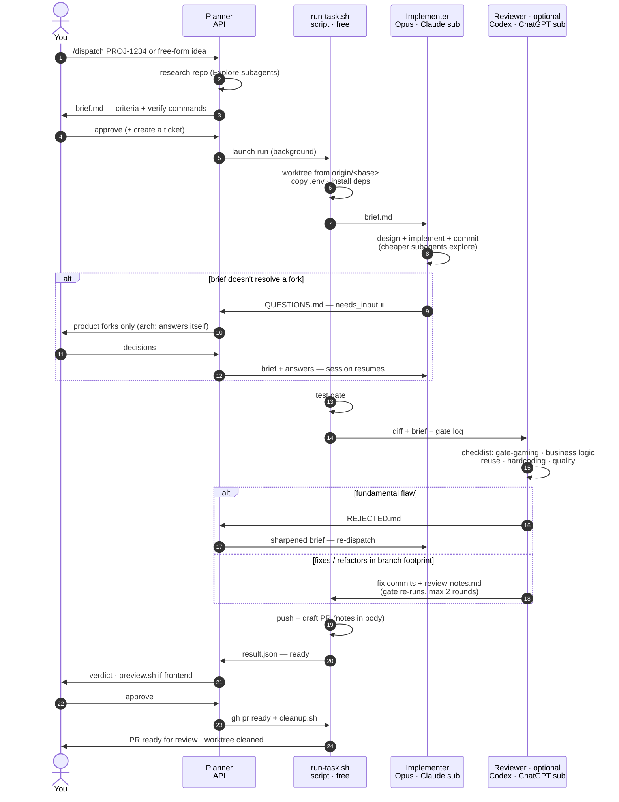

# Dispatch Harness

A multi-model pipeline for shipping code: **one model plans, a second
implements, a deterministic gate runs, a third — from a different vendor —
reviews and fixes, and a draft PR opens.** You approve at the ends; the middle
runs unattended in a git worktree.

The design principle is simple: **no model grades its own homework.** The agent
that writes the code is never the agent that reviews it, and they come from
different vendors (Anthropic and OpenAI), so a blind spot in one model's
training is unlikely to be shared by the other. Between them sits a gate no
model can talk its way past.

```
you → planner → [ implementer → gate → reviewer → gate ] → draft PR → you
  (your session)  (Claude sub)  (free)  (ChatGPT sub)
```

The planner isn't pinned by the harness: it is whatever Claude Code session
invokes `/dispatch`, billed however that session is billed — API credits or a
subscription. We've gotten the best results with **Claude Fable 5** as the
planner (sharper briefs up front mean fewer `needs_input` stops and review
fixes downstream); an Opus session on a Claude subscription also works, and
then the whole pipeline runs on flat-rate plans. Only the implementer and
reviewer are fixed by the pipeline.

---

## Why it's built this way

**Cross-vendor implement/review split.** The implementer (Anthropic's Opus —
`claude-opus-5` by default, via a Claude subscription) writes and commits. The
reviewer (OpenAI's Codex — `gpt-5.6-sol` by default, via a ChatGPT
subscription) reads the diff cold and fixes what it finds. Neither
sees the other's reasoning — only the committed result. A self-review by the
same model tends to rationalize its own choices; a different model from a
different lab does not. The reviewer is the one optional stage: without the
`codex` CLI the same pipeline runs in [Claude-only mode](#claude-only-mode).

**A deterministic gate between the models.** Between implement and review runs a
plain test gate — your repo's own `lint`/`type-check`/`test` commands, no model
in the loop. It is the objective checkpoint: green or red, no narrative. Because
a model *could* make the gate green by weakening the tests, the reviewer's
**first and highest-priority checklist item is anti-gate-gaming**: it hunts for
weakened or deleted tests, skipped cases, loosened assertions, hardcoded
expected values, and edited fixtures — and restores proper tests and fixes the
code instead. A green gate only counts if the tests earning it weren't touched.

**Subscription economics.** The expensive, low-volume work — research and the
brief — runs in your orchestrator session, billed however that session is
billed (in our experience Claude Fable 5 on API credits earns its price here;
a subscription session works too). The expensive, *high-volume* work —
implementing and reviewing, which burn the most tokens — runs on flat-rate
**subscriptions** (Claude and ChatGPT) that you already pay for. The glue between stages (worktrees, the gate, the PR)
is deterministic shell and costs nothing. You get frontier models on the
token-heavy stages without metered token bills for them.

**`needs_input`: stop, don't guess.** When the implementer hits a fork the brief
doesn't resolve — a genuine product or priority decision — it does **not**
guess. It writes the specific question(s) to `QUESTIONS.md` and stops the run
with status `needs_input`. Worker sessions are **resumable**: the planner (or
you) appends answers to the brief and re-dispatches the exact same command, and
the worker continues with its full context intact — it does not start over. You
can also step into the live session interactively at any time.

**Per-model commit attribution.** Every run records `opus_head` — the commit SHA
that marks the boundary between the implementer's work and the reviewer's fixes.
Commits up to it are the implementer's; commits after it are the reviewer's.
Attribution lives only in the run's metadata, never in the commit messages
themselves (the commits stay clean — no AI or agent mentions), so you always
know which model wrote what without polluting the history.

---

## Architecture

The full pipeline, stage by stage (source: [`FLOW.md`](FLOW.md); a printable
one-page version is in [`harness-flow.html`](harness-flow.html)):



Each run gets its own git worktree (`<repo>-<ticket>`), so multiple tickets run
in parallel without colliding. The brief and all metadata live in a
`.harness/` directory inside the worktree that is git-excluded — it never ships
in a commit or PR.

**Spec attachments.** When the real spec lives in an office document — a Word
feature spec, an Excel rules table, a PDF — the planner converts it to markdown
with [anydoc](https://github.com/firecrawl/anydoc) (`npx -y @firecrawl/anydoc
<file> -o <run-dir>/specs/<name>.md`: 14 formats, auto-detected, nothing to
install) and leaves it in the run dir. Everything under the run dir's `specs/`
is mounted at `.harness/specs/` in the worktree before the implementer starts,
and both workers are told to read it as part of the task contract — so the
detail the brief distils stays consultable instead of being paraphrased away.
When the run dir has a `specs/` directory, re-dispatching replaces the mounted
set wholesale with its current contents, so a revised spec never piles up next
to the version it supersedes. To withdraw every spec from a run in flight,
leave that directory present but empty; an absent source directory is a no-op.
The pipeline never runs `anydoc` itself; conversion is planner-side only.

---

## Prerequisites

Required:

- **[`claude`](https://docs.claude.com/en/docs/claude-code) CLI** — runs the
  implementer (and, if you like, the planner) on a Claude subscription.
- **`gh`** (GitHub CLI, authenticated) — pushes branches and opens PRs.
- **`jq`** — reads/writes run metadata.
- **`git`**, **`bash`**, and standard Unix tools: `curl`, `perl`, `lsof`,
  `uuidgen`. macOS ships all of these; on Linux install `uuid-runtime` (for
  `uuidgen`) and `lsof` if missing.

Optional, strongly recommended — it is the whole cross-vendor review stage:

- **`codex` CLI** (≥ 0.145) — runs the reviewer on a ChatGPT subscription.
  Older versions reject the default reviewer model (`gpt-5.6-sol`). Without it
  the harness runs in [Claude-only mode](#claude-only-mode).

Optional (only for `station.sh`, the parked orchestrator session you drive from
your phone):

- **`tmux`** — `station.sh` runs the session inside it. Nothing else in the
  harness needs tmux.

Optional (only for `schedule.sh`, firing a prepared run at a set time, and for
`quartermaster.sh --install`, its daily 19:00 agent):

- **`launchctl`** — the macOS launchd client. It ships with macOS and exists
  nowhere else, which is why arming a schedule is the one macOS-only flow in
  the harness: everything else, including `quartermaster.sh --report`, runs
  anywhere.

Optional (only for [`wall.sh`](#the-wall), the big-screen run dashboard):

- **`node`** (≥ 20) — runs the wall's zero-dependency HTTP server. Nothing else
  in the harness needs it.

Optional (only for [mirroring runs](#runs-from-any-machine-harness_mirror) to
another machine's wall):

- **`rsync`** — copies the run dir to the target. Guarded: without it, a
  mirrored run simply isn't mirrored. A remote target also needs `ssh` reaching
  the host non-interactively (key auth, already in `known_hosts`).

Optional (only for the auto-recorded PR demo videos on frontend runs):

- **[`shot-scraper`](https://shot-scraper.datasette.io/)** — records the
  storyboard.
- **`python3`** — runs the interactive login capture when `shot-scraper` was
  installed outside uv's default tool directory.
- **[`rclone`](https://rclone.org/)** — uploads the video to object storage
  (any S3-compatible bucket: Cloudflare R2, AWS S3, Backblaze B2, MinIO).
- **`ffmpeg`** — transcodes the recording and builds the preview GIF.

Optional (only for the copyable Postgres preflight example): **`docker`** and
**`nc`**.

Optional, for [spec attachments](#architecture) (planner-side) and for
[the Quartermaster](#the-quartermaster)'s capacity estimate: **`npx`** with Node
20+ — converts document attachments to markdown via `npx -y @firecrawl/anydoc`,
and reads each station's local token accounting via `npx -y ccusage@latest`.
Nothing in the pipeline itself invokes it.

Portability notes: the scripts target **bash 3.2** (the macOS default). macOS
ships no `timeout(1)`, so the harness uses a `perl -e 'alarm ...'` wrapper as a
process cap. Arming a launchd agent (`schedule.sh`, `quartermaster.sh --install`)
is the only macOS-only flow and requires `launchctl`; `osascript`, used
elsewhere for local desktop notifications, is guarded, so on Linux notifications
are simply skipped (phone push via [ntfy](https://ntfy.sh) still works). CI
([`.github/workflows/gate.yml`](.github/workflows/gate.yml)) runs the gate on
Linux to keep the shipped scripts portable.

### Claude-only mode

Every run detects the `codex` CLI at startup, so one codebase serves both
setups — there is no separate install variant or flag:

- **codex present** — nothing changes: full arm, review and fix rounds, Codex
  resolves base-sync conflicts.
- **codex absent** — the run pins the `no_review` arm, emits a
  `review skipped — no codex CLI found (Claude-only mode)` stage line (visible
  in the statusline, timeline and notifications), and leaves `reviewer_model` /
  `reviewer_effort` empty in `result.json` rather than claiming a review that
  never ran. The review is skipped, not reassigned to a second Claude worker —
  no model grades its own homework. Base-sync conflict resolution (PR
  mechanics, not quality review) falls back to a Claude worker on your
  subscription — same prompt, fresh session, logged to `claude-<label>.log`.

Everything else is identical: worktree, deterministic gate, `needs_input`
escalation, PR, demo recording. Install `codex` later and the next dispatch
gets the review stage back; runs already pinned to an arm keep it — a
Claude-only run resumed on a machine that now has `codex` keeps its blank
reviewer fields (its review is not retro-fitted) and uses codex only for the
mechanical base-sync conflict step.

---

## Quickstart

```bash
git clone <this-repo> dispatch-harness
cd dispatch-harness

# Symlinks scripts into ~/.claude/harness and the skill into
# ~/.claude/skills/dispatch/. Re-runnable; never clobbers your local config.
# It also offers to wire the live statusline into ~/.claude/settings.json.
./install.sh          # or ./install.sh --copy for detached copies
                      # --statusline / --no-statusline to decide up front

# Pin a repo onto the pipeline (optional — anything unset is auto-detected).
# setup-repo.sh inspects the repo and writes a complete, pinned entry for you:
~/.claude/harness/setup-repo.sh /path/to/your/repo            # preview the proposal
~/.claude/harness/setup-repo.sh /path/to/your/repo --write    # save it
# ...or hand-edit the file directly: $EDITOR ~/.claude/harness/repos.local.sh

# Enable phone push / tune notifications (optional):
$EDITOR ~/.claude/harness/notify.conf
```

Then, from a Claude session in your orchestrator working directory:

```
/dispatch <TICKET-or-"a description of what to build">
```

The planner researches the repo, writes a brief, and shows it to you for
approval. On approval it launches the run in the background:

```bash
~/.claude/harness/run-task.sh <TICKET> <repo-path> <branch-name>
```

When the run finishes you get a verdict and, if it's `ready`, a draft PR. See
[`skills/dispatch/SKILL.md`](skills/dispatch/SKILL.md) for the full planner
protocol.

### Scheduling a run for later

`schedule.sh` takes the same arguments as `run-task.sh` plus a time, and fires
that run for you — the planner writes the brief tonight, the pipeline works
while nobody is at the desk, and the reviewed PR is open when the office
arrives.

```bash
~/.claude/harness/schedule.sh <TICKET> <repo-path> <branch-name> 08:10
~/.claude/harness/schedule.sh <TICKET> <repo-path> <branch-name> "2026-08-06 08:10"
~/.claude/harness/schedule.sh --list             # what is pending, soonest first
~/.claude/harness/schedule.sh --cancel <TICKET>  # disarm (the brief is kept)
```

The brief must already exist at `runs/<TICKET>/brief.md` — scheduling arms a
prepared run, it never writes a brief. A bare `HH:MM` means the next occurrence
(today if that is still ahead, tomorrow otherwise); the absolute form is local
time too. A time in the past, a date that does not exist, or a missing brief is
refused on the spot rather than at 08:10.

**How it fires.** Arming writes a one-shot wrapper into the run dir and loads a
per-user launchd LaunchAgent (`com.olyx.dispatch.<ticket>`) with a single
`StartCalendarInterval` for that minute. launchd has no `Year` field, so for a
far-future absolute date the wrapper ignores earlier annual calendar matches
and stays armed until the marker's fire epoch. At or after that epoch, it
deletes its own plist, wrapper and marker *before* dispatching, then runs
`run-task.sh` with output in `runs/<TICKET>/scheduled.log` and boots its own
agent out of launchd last — so a crash, a reboot or a calendar rollover can
never turn one schedule into two runs. While a schedule is armed,
`runs/<TICKET>/scheduled` holds its fire epoch; `--cancel` removes the agent,
the plist, the wrapper and that marker, and leaves the brief alone.

**It runs as the shell that scheduled it.** The wrapper carries a snapshot of
the scheduling shell's harness environment — every `HARNESS_*` variable
(`HARNESS_OWNER`, notification settings, …), `CLAUDE_CONFIG_DIR`, `CODEX_HOME`,
`GH_CONFIG_DIR`, `GH_TOKEN`, the model/effort knobs and `PATH` — because launchd
hands a job an almost empty environment. That snapshot can therefore contain a
token, so the wrapper is written **mode 600** and lives in the run dir with the
rest of the run's metadata. Anything you would `export` before `run-task.sh`,
export before `schedule.sh` instead.

**Sleep, honestly.** launchd does not wake the machine for a
`StartCalendarInterval`; a fire time missed while the Mac was asleep is
coalesced into the next wake. The promise is therefore
"08:10, or as soon as the machine wakes after that" — good enough for a laptop
opened in the morning, and exact only on a machine that stays awake. For a hard
08:10, arm it on the always-on office Mac — schedules do not travel, a run fires
on the machine it was scheduled on. (`station.sh` already runs under
`caffeinate`.)

macOS only — `launchctl` is the mechanism, and on any other platform
`schedule.sh` says so and exits instead of arming something that will never
fire.

To point the whole harness somewhere other than `~/.claude/harness`, set
`HARNESS_DIR` (every script honors it) and install with
`HARNESS_DIR=/path ./install.sh`.

### Capacity preflight: a run that defers itself

A dispatch launched into an exhausted subscription window is pure waste. It
pays for a worktree, a deps install and an implementer spawn, dies instantly on
*"You've hit your session limit · resets 1:30pm"*, and records
`implementer_failed` — indistinguishable from a real failure, and recovered by
a human re-arming it. So `run-task.sh` checks first.

Before the worktree, it asks the launching identity's *own* Claude logs
(`CLAUDE_CONFIG_DIR`, through the same
[local-file accountant the quartermaster uses](#the-quartermaster) —
`capacity.sh`, `ccusage … --offline`, no endpoint contacted from anywhere) how
much of the current five-hour block is left. If the block is exhausted, or
fewer than `HARNESS_MIN_SESSION_TOKENS` output tokens remain, the run does not
spawn. It hands *itself* to `schedule.sh` for the block's reset time plus
`HARNESS_DEFER_BUFFER_SECS`, writes a status line the wall and `status.sh`
show —

```
deferred: capacity, armed for 13:35
```

— pushes it through the usual notification path, and exits 0. Nothing was
built, nothing was installed, no model was called. Because `schedule.sh`
snapshots the environment of the shell that arms it, and that shell is the run
itself, the deferred dispatch fires with the identity, config dirs and knobs it
was launched with; on disk it is indistinguishable from a human-armed one
(`runs/<TICKET>/scheduled`, `schedule.sh --list`, and the quartermaster's
`already armed` skip all just work).

**Belt to the braces: the mid-run self-resume.** A window can also empty
*during* a run — the single biggest sink in the corpus that motivated this, 25
attempts and 8.6 hours burned, most of them recoverable. When the implementer
exits non-zero and the session-limit message appears in the live feed, its
stderr, or its final result message, the run is classified as capacity rather
than `implementer_failed` and takes the same path: `deferred: capacity`, one
one-shot armed for the reset, and the scheduled dispatch resumes the pinned
implementer session exactly as a human re-dispatch would. Nobody has to notice.
The phone push says so in a sentence — *"session limit — self-resuming at
13:35"* — and `metrics.sh --report` counts these under `capacity self-resumes`.

A mid-run limit therefore always defers, because it always has a reset time to
aim at:

1. ccusage's block reset, the authority whenever it can answer at all;
2. failing that, the wall-clock time the limit message itself names (*"resets
   1:30pm"*, read in the operator's timezone) — prose, so it is the fallback
   rather than the source;
3. failing both, one hour, written into `capacity.log` as the guess it is.

**Advisory, never a blocker.** ccusage missing or erroring, and a `schedule.sh`
that refuses to arm, log one line and dispatch anyway. `HARNESS_PREFLIGHT=off`
disables the preflight and the mid-run classifier together. With capacity in
hand, a run behaves exactly as it did before this existed — the check writes its
verdict to `runs/<TICKET>/capacity.log` and says nothing on the console.

**And it stops.** A run auto-defers at most `HARNESS_MAX_DEFERRALS` times —
preflight and mid-run self-resumes counted together in
`runs/<TICKET>/deferrals`. After that it fails as `capacity_failed` — a status
of its own, so the honest outcome is never dressed up as a broken implementer,
and no run can reschedule itself forever.

| Env var | What it does | Default |
| --- | --- | --- |
| `HARNESS_PREFLIGHT` | `off` disables the capacity preflight *and* the mid-run classifier | `on` |
| `HARNESS_MIN_SESSION_TOKENS` | Output-token headroom a dispatch wants before it will spawn | `20000` |
| `HARNESS_DEFER_BUFFER_SECS` | Clearance added past the block's reset time when arming | `300` |
| `HARNESS_MAX_DEFERRALS` | Auto-deferrals allowed per run before it fails honestly | `2` |

### Turn ceiling: a run that resumes itself

The implementer is spawned with `--max-turns`, a guard rail against a worker
that loops forever. Pinned at 120 it killed eight runs — nearly always at the
finish line, mid-wrap-up, writing the notes or staging the diff. The recovery
was always the same: a human noticed, re-dispatched, and the resumed session
finished in minutes. So `run-task.sh` does that itself.

The ceiling is `HARNESS_MAX_TURNS` (default **200**), **pinned at first
dispatch** into `runs/<TICKET>/max-turns` like the model and effort knobs, so
every later resume spends the ceiling the run was dispatched with rather than
whatever the resuming shell exports. A value that is not a positive integer
falls back to the default with one line on the console — and the fallback is
re-pinned, so it says it once, not on every resume.

When the implementer stops on turn exhaustion (the CLI's `error_max_turns`
result — a structured outcome, not a message we parse), the run does **not**
fail. It re-invokes the same pinned session, in the same worktree, with the same
ceiling — byte for byte what a re-dispatch does — and says so:

```
resuming: turn ceiling (1/2)
```

`HARNESS_MAX_RESUMES` (default **2**) bounds it, counted in
`runs/<TICKET>/turn-resumes`. Only once that budget is spent does the run
surface `implementer_failed`.

Two things outrank the turn budget. A **session limit** is classified first, so
a run whose window emptied mid-flight takes the
[capacity deferral](#capacity-preflight-a-run-that-defers-itself) instead of
burning resumes on a session that cannot spawn anyway. And a pending
`.harness/QUESTIONS.md` still pauses the run as `needs_input`: a worker that
stopped to ask is never talked over.

**Commit hygiene that survives a resume.** A resumed session carries its
original instructions far behind it in a long context, and resumes have
re-added `Co-Authored-By: Claude` trailers their first pass never wrote. So
every continuation message restates the binding commit rules, and — because a
prompt is not a guarantee — the implementer stage ends with a deterministic
backstop on **every** arm, review or not: `base..HEAD` is scanned for AI
attribution (`Co-Authored-By:`/`Generated with …` naming Claude or Anthropic,
any `Claude-*:` trailer), and any that is found is stripped mechanically. Only
commit *messages* are rewritten — each commit is re-created against its
original tree object, so the diff, the working copy and the commit count are
untouched, a genuine human `Co-Authored-By:` is left alone, and a range with
nothing to strip keeps its shas.

| Env var | What it does | Default |
| --- | --- | --- |
| `HARNESS_MAX_TURNS` | Turn ceiling for the implementer's session; pinned at first dispatch | `200` |
| `HARNESS_MAX_RESUMES` | Automatic resumes allowed on turn exhaustion before the run fails (`0` opts out) | `2` |

### Attempts: a run is a ticket, an attempt is a dispatch

A run gets re-dispatched — after a question, after a failure, after a session
limit — and everything below distinguishes the two.

**Per-attempt telemetry survives the attempt.** Every invocation used to
truncate `opus-stream.jsonl`, `gate-rounds.log` and `opus.log` on the way in, so
each re-dispatch destroyed the evidence of the attempt it was recovering from
(in one 46-run corpus: the turn counts and gate detail of all 36 failed
attempts, unrecoverable). They are now **rotated**, not truncated:

```
runs/<TICKET>/
  opus-stream.jsonl      the live attempt, exactly where it has always been
  gate-rounds.log
  opus.log
  attempts/1/{opus-stream.jsonl,gate-rounds.log,opus.log}   attempt 1's own
  attempts/2/…                                              attempt 2's own
  attempts.log           <n> <status> <started> <ended>, one row per attempt
```

The live filenames never move, so everything reading the current attempt — the
wall, the classifiers, `metrics.sh`, the reviewer — is untouched. The attempt
number is the count of `__invocation__` markers in the append-only `stages.log`.
`result.json` gains `attempt` (this invocation's ordinal), `attempts_total`, and
`metrics.attempts` (the ledger), all additive; `metrics.turn_resumes` now counts
**this invocation's** resumes rather than the run's lifetime total.

**A finished run is not dispatched again.** Five runs in that same corpus were
re-armed *after* reaching `done: ready`, burning 3.9 hours on work that was
already in a PR — and one of them came back `push_failed`, turning a finished
run into a broken one. So a dispatch of a run whose status is `done: ready`
refuses before anything is touched (no worktree, no marker, no `result.json`
rewrite), printing the PR it already produced. Every other status keeps today's
behaviour: re-dispatching after a failure, a question or a deferral is the
normal path. The deliberate override — a revised brief on a shipped branch, a PR
closed by hand — is `HARNESS_REDISPATCH=1`.

| Env var | What it does | Default |
| --- | --- | --- |
| `HARNESS_REDISPATCH` | `1` dispatches a run that already reached `done: ready` | unset |

### The Quartermaster

Subscription capacity that is still unused at the end of the day expires
worthless, while dispatchable work sits in the tracker. `schedule.sh` can fire a
prepared run at 02:00 — but somebody has to decide, every evening, *which* runs
and *how many*. `quartermaster.sh` is that decision, made at 19:00:

```bash
~/.claude/harness/quartermaster.sh              # --report: the plan, arms nothing
~/.claude/harness/quartermaster.sh --arm        # actually arm it
~/.claude/harness/quartermaster.sh --install    # a daily 19:00 agent that reports
~/.claude/harness/quartermaster.sh --uninstall  # remove that agent
```

**The crew convention is the consent.** A Linear issue labelled `overnight`
**and assigned to somebody** is a ticket that person is happy to have run
overnight, under their own identity. The label alone is not enough and the
assignee alone is not enough — the pair is the handshake. Crew members are
directories under `~/accounts/` (`QM_ACCOUNTS_DIR`), one per station, each with
`claude/`, `codex/` and `gh/` inside it; an assignee's email maps to a station
by its local part up to the first dot, so `angel.sole@olyx.nl` is `~/accounts/angel`.
An assignee with no station on this machine is reported, never guessed at.

**A brief is still the contract.** A tagged ticket is armable only when
`runs/<TICKET>/brief.md` already exists — the same human-approved brief
`schedule.sh` demands. Tagged tickets without one are listed under *needs a
brief* and left alone; generating briefs from tickets unattended is deliberately
not something this does. Tickets already armed, already running, or already
delivered (a `result.json` with a `pr_url`) are skipped with the reason, which
is what makes a second run at 19:05 arm nothing at all.

**Capacity, honestly estimated.** Per station,
`CLAUDE_CONFIG_DIR=~/accounts/<name>/claude npx -y ccusage@latest blocks --json
--offline` reads that station's *own log files* — no endpoint is contacted, by
anyone, anywhere in this script. Headroom is measured in output tokens, the
only unit available on both sides of the sum: the ceiling is the busiest
completed five-hour block ccusage can still see (or `QM_TOKEN_LIMIT` when you
know your real one), and what is left of it in the current block is the proxy
for tonight's capacity. One run costs the median
`metrics.implementer_usage.output_tokens` over the last `QM_HISTORY` runs, so
the estimate is this machine's own history rather than a guess. Then
`N = floor(remaining × QM_SAFETY / median cost)`, capped at `QM_MAX_PER_CREW`.
It is an estimate, and the safety factor is there because it is one — when
ccusage cannot account for a station at all, the report says so and falls back
to `QM_FALLBACK_N` rather than inventing a number.

**What `--arm` does.** Eligible tickets take the fire times in `QM_TIMES` in
queue order (priority first, oldest first within a priority), and each is handed
to `schedule.sh` with that station's environment exported — `CLAUDE_CONFIG_DIR`,
`CODEX_HOME`, `GH_CONFIG_DIR`, `HARNESS_OWNER`, `IMPLEMENTER_EFFORT=high` — so
the snapshot `schedule.sh` writes carries the right identity to 02:00. A
`GH_TOKEN` exported in the invoking shell is *unset* for that call: `gh` prefers
a token over its config dir, and one would quietly make every crew member's PR
come out of the same account. Each armed ticket then gets a Linear comment
saying when it was armed; a failed comment is reported and never unarms a run.
Slots already spent tonight count against `N`, so reruns neither double-arm nor
hand out a fire time twice.

**The report.** Every run writes `runs/quartermaster/<YYYY-MM-DD>.md` — per crew
member: estimated headroom, median run cost, `N`, what was armed (or would be),
what needs a brief, and every skip with its reason — and pushes a compact
summary to your phone through the same `HARNESS_NTFY_TOPIC` in `notify.conf`
that stage handoffs use. No topic configured means the report file only.
`--report` is side-effect-free outside that file: it arms nothing, comments on
nothing, and exits 0 even when Linear is unreachable or ccusage fails, because
a partial report at 19:00 is worth more than a crash.

**The trust dial.** `--install` writes a daily launchd agent
(`com.olyx.quartermaster`, `QM_AT` to move it off 19:00) running `--report`, on
the same conventions as `schedule.sh`: a mode-600 wrapper carrying an
environment snapshot, because launchd hands a job almost nothing. It only
reports until you decide otherwise; `--install --arm` (or editing the mode
argument in the plist) is the one-line flip to letting it act. macOS only, like
`schedule.sh` — `--report` itself runs anywhere.

| Env var | What it does | Default |
| --- | --- | --- |
| `QM_SAFETY` | Fraction of the estimated headroom to spend | `0.5` |
| `QM_MAX_PER_CREW` | Hard ceiling on runs per crew member per night | `3` |
| `QM_FALLBACK_N` | Runs to allow when capacity is unknowable | `1` |
| `QM_TIMES` | Fire times, handed out in queue order | `"23:30 02:00 04:30"` |
| `QM_LABEL` | The consent label | `overnight` |
| `QM_ACCOUNTS_DIR` | Where the crew's stations live | `~/accounts` |
| `QM_HISTORY` | Runs sampled for the median cost | `20` |
| `QM_DEFAULT_COST` | Median cost when there is no history yet | `40000` |
| `QM_TOKEN_LIMIT` | Pin the block ceiling instead of inferring it | unset |
| `QM_AT` | When `--install` fires | `19:00` |
| `QM_PAGE` | Issues fetched per Linear request (all pages are followed) | `100` |
| `QM_CCUSAGE_TIMEOUT` | Seconds allowed for each local ccusage read | `120` |
| `QM_LINEAR_TIMEOUT` | Seconds allowed for each Linear request | `20` |
| `QM_NTFY_TIMEOUT` | Seconds allowed for the ntfy report push | `10` |
| `QM_EFFORT` | `IMPLEMENTER_EFFORT` for armed runs | `high` |
| `LINEAR_API_KEY_FILE` | The Linear key (mode 600, never echoed anywhere) | `$HARNESS_DIR/linear-api-key` |

---

## Configuration

### Per-repo config: the `repo_config` contract

`repos.conf.sh` (shipped) auto-detects sensible defaults for any repo: install
and gate commands from the lockfile, base branch from the remote's default. To
**pin** settings for a specific repo, add a `repo_config_local()` case arm to
`~/.claude/harness/repos.local.sh` (gitignored — `install.sh` seeds it for you).
It runs *before* auto-detection; any field you leave blank is still
auto-detected.

Keys are the repo's directory name (`basename`). Worktrees are named
`<repo>-<ticket>`, so match both `<repo>` and `<repo>-*`.

#### `setup-repo.sh` — generate the pin for you

Hand-writing a pin means reading the repo and getting `GATE_CMD` exactly right
(a wrong one silently weakens the whole pipeline). `setup-repo.sh` does that
inspection instead:

```bash
setup-repo.sh <repo-path>            # print the proposed entry + a rationale
                                     #   per field; writes nothing (dry run)
setup-repo.sh <repo-path> --write    # save it into repos.local.sh
setup-repo.sh <repo-path> --verify   # prove INSTALL_CMD + GATE_CMD pass first
setup-repo.sh <repo-path> --ai       # let a model refine the proposal
```

It reads `package.json` scripts, `pyproject.toml` / `uv.lock`,
`.github/workflows`, `.env*` layout, the dev-server port and `.mcp.json` to
compose a complete entry — e.g. a `GATE_CMD` of `npm run type-check && npm test`
rather than a bare `npm test`. It never invents commands: a field it can't
determine is left blank (honestly reported) for runtime auto-detection.

- **`--verify`** runs `INSTALL_CMD` then `GATE_CMD` in a throwaway worktree and
  refuses to `--write` if either fails, so you never pin an entry that doesn't
  actually pass.
- **`--ai`** makes one *read-only* `claude -p` call (model via `SETUP_MODEL`,
  default `sonnet`; set `opus` for a harder look) that can only read the repo,
  validates its JSON, and falls back to the deterministic proposal on any
  failure — it works fine with `claude` absent.
- **`--write`** manages the arms between the `# >>> setup-repo managed >>>`
  markers in `repos.local.sh`; re-running a repo updates its arm in place. A
  hand-written file without those markers is never modified — it prints the
  block for you to paste. New installs get the managed structure from
  `repos.local.sh.example`; existing ones keep working unchanged.

`setup-repo.sh` only *suggests* a `PREFLIGHT_CMD` (e.g. when it spots a
docker-compose DB) — it never writes an untested preflight path.

| Variable | Purpose | Default |
| --- | --- | --- |
| `BASE_BRANCH` | Base branch PRs target | detected: `staging` → `main` → `master` |
| `INSTALL_CMD` | Install deps in a fresh worktree | from lockfile (`npm ci` / `yarn install` / `uv sync`) |
| `GATE_CMD` | The deterministic test gate | from lockfile (`npm test` / `yarn test` / `uv run pytest`) |
| `MCP_CONFIG` | Path to an `.mcp.json` the worker loads | none (skipped if the path is missing) |
| `ENV_SUBDIRS` | Extra dirs besides `.` to copy `.env*` into | none |
| `DEV_CMD` | Dev server command for `preview.sh` | `npm run dev` |
| `PREFLIGHT_CMD` | Env check run *before* the implementer (e.g. test DB up + migrated) | none |
| `DEMO_DEV_CMD` | Dev server command for demo recording (must pin the port) | none |
| `DEMO_PORT` | Port `DEMO_DEV_CMD` binds (storyboard origin + post-demo cleanup) | none |
| `PREPROD` | `1` = repo is not in production yet: both worker prompts get the greenfield posture | none |

`GATE_CMD` is the heart of it: it is the objective checkpoint both models are
measured against. Point it at the strictest fast feedback your repo has —
types, lint, and tests.

`PREFLIGHT_CMD` fails a run fast on a broken environment *before* burning an
implementer pass. See
[`examples/preflight-postgres.example.sh`](examples/preflight-postgres.example.sh)
for a Postgres test-DB check.

#### `PREPROD` — the pre-production posture

Both models default to conservative, compatibility-preserving changes. That is
the right instinct for a live system and the wrong one for a repo that has no
users yet, where a compatibility layer is dead weight from the day it lands.
Pin `PREPROD=1` and `run-task.sh` appends a posture block to the implementer
**and** the reviewer prompts: remove obsolete paths instead of adding
compatibility layers, fallbacks or migrations; choose the simplest
implementation that fully meets the current requirements; grow the system in
layers without trading a working product for unfinished complexity; keep
components modular; prefer established libraries, and the dependencies already
in the project, over your own implementation; decide architecture for the long
term rather than accepting a stopgap. The reviewer is told the same thing
explicitly — otherwise it spends its round demanding the back-compat shims the
implementer was told not to write.

It is a pin, never a detection: no heuristic gets to decide a repo is
pre-production. With `PREPROD` unset both prompts are byte-identical to a run
without the feature — [`tests/preprod.test.sh`](tests/preprod.test.sh) captures
the real prompts from a fabricated run and asserts it.

### Local config files (all gitignored)

`install.sh` seeds each of these from its `*.example` the first time and never
overwrites an existing copy:

- **`repos.local.sh`** — per-repo pins (above).
- **`notify.conf`** — desktop + phone (ntfy) notifications on stage handoffs.
- **`demo.conf.sh`** — object-storage remote for uploading PR demo videos.

One more file is **not** seeded, because it is a credential and you should
create it deliberately: `linear-api-key` (mode 600, `LINEAR_API_KEY_FILE` to
move it), read only by [the Quartermaster](#the-quartermaster). Without it the
quartermaster still reports capacity and simply says the queue was unreadable.

### Worker sandbox and MCP denies

The implementer runs under
[`worker-settings.json`](worker-settings.json), which allow-lists the tools it
needs (edit/write, `npm`/`npx`/`yarn`/`node`/`uv`, read-only git, common shell
utilities) and **denies the ones that could do damage**: `git push`,
`git checkout`, `git switch`, and `gh`. The harness itself owns pushing and PR
creation; the worker must never touch remotes or switch branches.

**This file governs the Claude worker and nothing else.** It is a Claude
settings file, passed to the implementer and to the Claude conflict resolver; no
`codex` invocation consumes it, and none ever has. What bounds the Codex
reviewer is its own sandbox plus the harness-owned `CODEX_HOME` described under
[What the reviewer is allowed to reach](#what-the-reviewer-is-allowed-to-reach)
— which is why that config dir exists, and why it carries none of the operator's
rules.

If your worker loads an MCP server (via `MCP_CONFIG`) that exposes destructive
tools — switching a database environment, deploying, deleting records — **add
those tool names to the `deny` list in your installed copy** of
`worker-settings.json`. For example, to forbid an environment switch exposed by
a database MCP:

```jsonc
"deny": [
  "Bash(git push:*)",
  "Bash(git checkout:*)",
  "Bash(git switch:*)",
  "Bash(gh:*)",
  "mcp__your-db__switch_environment"
]
```

Deny lists are cheap insurance; add to them liberally.

---

## Monitoring

Each run writes plain files under `~/.claude/harness/runs/<RUN-ID>/`, and the
tooling reads them. Wire the statusline once and monitoring is ambient; skip it
and `status.sh --watch` gives you the same picture on demand.

- **Statusline** (`statusline.sh`) — a line per active run in every Claude
  session on the machine: run id, which model has it, the tool/file it is
  touching right now, `±lines` against the base, elapsed minutes. A red `⏸`
  line means `needs_input`. Finished runs, and runs whose status hasn't moved
  in 6h, drop off by themselves.

  `install.sh` offers to wire it into `~/.claude/settings.json` for you (only
  with your consent, and it backs the file up first). By hand:

  ```jsonc
  "statusLine": {"type": "command", "command": "~/.claude/harness/statusline.sh"}
  ```

  Already have a statusline command? Keep it and append the run lines:

  ```bash
  <your command>; ~/.claude/harness/statusline.sh --runs-only
  ```

  `--runs-only` emits nothing but run lines and reads no stdin — the session
  JSON can only be consumed once, so your own script keeps it.

- **`status.sh --watch`** — the zero-config alternative: a live dashboard in any
  terminal (run, actor, stage, current activity, time in stage, total),
  redrawn in place every 2s (`HARNESS_WATCH_INTERVAL` to retune).
- **Notifications** — a desktop banner (macOS `osascript`) and/or a phone push
  (ntfy) on every stage handoff. Silence the desktop ones with `HARNESS_NOTIFY=0`.
- **`HARNESS_MIRROR`** — mirror this machine's run dirs onto another machine
  while they run, so its wall shows them too:
  [Runs from any machine](#runs-from-any-machine-harness_mirror).
- **`status.sh`** — one-shot table of all runs; `status.sh <RUN-ID>` prints a
  run's full timeline and result.
- **`feed.log`** — a live transcript across both model stages
  (`tail -f ~/.claude/harness/runs/<RUN-ID>/feed.log`): the implementer's tool
  calls and thinking, then the reviewer's output prefixed `◆ codex`.
- **`attach.sh <RUN-ID>`** — step into the worker's session interactively, with
  full context (it warns before forking a still-running worker).
- **`preview.sh <RUN-ID>`** — run the dev server inside the worktree to see the
  change live before approving.

The paper trail per run: `brief.md`, `specs/` (converted spec attachments, when
the task had any), `QUESTIONS.md`, `implementer-notes.md`, `review-notes.md`,
`feed.log`, `gate-*.log`, `result.json`, `opus-head`, `capacity.log`
(the [preflight's](#capacity-preflight-a-run-that-defers-itself) verdict), and
`attempts/<n>/` plus `attempts.log` — every earlier attempt's stream, gate
rounds and final message, kept instead of overwritten
([Attempts](#attempts-a-run-is-a-ticket-an-attempt-is-a-dispatch)).

### Ghost Shift

`wall.sh` is the same picture for a room instead of a terminal: a read-only web
page for an office TV showing what every agent is doing right now. It reads the
same run dirs as everything above and never dispatches anything.

The wall is a **city at night**. Each project is a tower; each run is a lit car
climbing it; the floor the car has reached is the run's pipeline stage — street
level is setup, then implement, gate, review, demo, and the roof is the PR. The
car carries the neon of whichever model owns that stage, so a glance across the
room reads as *which repos are busy, how far along, and who is driving*:

| On the wall | What it means |
| --- | --- |
| A tower | One project. It stands only while it has live work — a repo nobody is working in right now is simply not in the skyline. Its silhouette is stable, so the room learns the city as a place. |
| A lit car | One run, at the floor of its current stage, in its actor's neon. |
| A rooftop beacon flare | A run reached `done: ready` and its PR is open. |
| A tower lighting up floor by floor | The same run, celebrating: six seconds of light climbing the facade, the rooftop lamp thrown wide and the ticker printing what shipped, before the run leaves the skyline the normal way. Once per run — a browser opening halfway through joins the beat in progress rather than replaying it. |
| A searchlight + red tower | A run wrote `QUESTIONS.md` and is waiting on a human. It is the loudest thing on the screen, and it pins the brief plate until you answer it. |
| A red flare, then dark | A rejected or failed run, burning out at the floor it stopped on. |
| A beam out of the cloud | The run the brief plate is currently featuring — its building lights up and the rest of the city steps back, so the plate and the skyline are never two separate stories. |
| A tinted light on the car | Who dispatched that run, in their own stable tint; the name itself is on the plate and in the ticker. `bot` gets the milk-white synthetic tint. |
| `UNCHARTED` | Runs whose worktree cannot be read — honest about the gap rather than filed under a repo they may not belong to. |

**The skyline is live.** A finished run gets one short completion moment — the
rooftop flare, or the burnout — and is then gone, and a tower with nothing left
standing in it goes with it. The city grows and shrinks with the work, which is
the only thing worth putting on a wall; yesterday's green ticks are in
`status.sh` and in the PR list, where you can act on them. `/api/runs` still
carries the finished runs (it is the honest snapshot of the run dirs) — the
skyline is the part that is live only.

**The district accretes.** Under the live towers, the week builds up. Monday
00:00 local the plain is empty; every run that reaches `done: ready` pours one
**permanent building** into it; by Friday the city *is* the week's shipped work,
with whatever is still being built rising among it. Last week's city stands
behind this one as a single flat ghost silhouette — the name finally earning
itself — and Monday 00:00 empties the plain again.

| In the district | What it means |
| --- | --- |
| A building | One run that shipped this week. It never leaves before Monday. |
| Its shape | The repo family: `olyx-agents` is residential, `olyxbase` / `olyx-dashboard` are industrial blocks, `valoryx-*` is an observatory spire, `dispatch-harness` is infrastructure, anything else is an honest mid-rise. |
| Its height | The run's diff (insertions + deletions), log-scaled and capped — a monster PR reads big without dwarfing the block. A recorded zero-line diff is the shortest building there is; an unreadable or structurally malformed `result.json` is *not a building*, because a height invented from a result the wall could not trust is the one thing that would make the city lie. |
| Where it stands | Hashed from the run id, so the skyline is identical on every screen and after every reload. |
| A small lit sign | Who dispatched it, in the same crew tint as their runs' cars — cooling to the district's neutral within six hours of landing. That is the whole of the attribution. |
| A lit shopfront row, and sometimes a neon | The ground floor, from the week's **first** ship. Which shop is under a building — a noodle bar, a diner, an arcade, a repair shop — and whether it carries a sign is hashed from the run id, so it is the same on both screens and the same tomorrow. |
| A few windows fading on and off | Occupancy: three windows per facade keeping their own hours, each on its own loop length and its own seeded phase. Nothing on this street blinks in unison. |
| Steam, somebody walking, a car going past | Nightlife, present whenever anything is standing. The week only sets the **tempo**: more people out (up to six), more vehicles (up to three), and the gap between passes falling from 48 seconds on the first ship to 11 on the twenty-fifth. |
| A mall block, a tram | The milestones, and now only that: extra texture at twelve and twenty ships, on top of a street that was already alive. |
| A pale flat outline behind | Last week. A height and a plot, nothing else — no windows, no signs, no types. An empty last week draws nothing. |

**The ledger is the city's memory.** *Permanent* is the contract, and a run dir
is not permanent: `cleanup.sh` promotes a run and mirror removal deletes the
mirrored copy off the wall's own machine, so a city derived from what happens to
be on disk would demolish a building the moment somebody tidied up after it. Run
dirs are therefore how the wall **discovers** a ship; one append-only JSONL file
is how it **remembers** one:

```bash
wall.sh --city /var/wall/city.jsonl   # default: beside --runs, as wall-city.jsonl
export WALL_CITY=/var/wall/city.jsonl # same thing
```

The first time the server sees a run at `done: ready` with a finish epoch in the
current week, it appends one line — `{id, epoch, repo, owner, insertions,
deletions}` — and never writes that run again. Everything a building *looks
like* is derived from that line at render time, so the mapping above can change
without rewriting history. One line per run id is also what makes a run mirrored
from another machine ([`HARNESS_MIRROR`](#runs-from-any-machine-harness_mirror))
harmless: the same ship discovered twice is still one building, and the first
sighting is the one that stands.

Monday's rollover prunes anything older than the two windows the wall can draw,
rewriting the file through a temp file and a rename. A missing or unreadable
ledger is an empty plain and one line on stderr; a corrupt *line* is skipped
rather than fatal. Nothing about the city can take the wall down — but
**deleting the ledger razes the city**, and nothing else does.
It is the only file the wall writes; it is not a schema, and nothing else in the
harness reads it.

One consequence worth knowing: the ledger records what the wall *witnessed*. A
wall started midweek picks up this week's ships whose run dirs are still on disk,
but a ship that was already cleaned up before the wall came up is not
backfilled — and last week's ghost is whatever last week's wall recorded.

Because a full district is normal on a Thursday evening, "nothing live" no
longer means "nothing happened": the `SHIFT STANDING BY` plate now appears only
when the week has **no buildings and no live runs**, and a week that shipped
work with nothing currently climbing gets one quiet `DISTRICT AT REST` line
instead. The wall never looks broken on a week that delivered.

**Rest is a mood, not a shutdown.** At rest the construction glow is gone and
the nightlife is not: a city is alive because somebody is eating noodles at one
in the morning, not because a crane is moving. All of it lives in the
ground-floor band, and every part of it drops a stop the instant something is
climbing — the skyline owns the room's eye whenever there is work on it.

Towers cannot carry type you can read from four metres, so two surfaces do:
a Blade Runner **brief plate** cycling the live runs in big letters (ticket,
project, stage, actor, dispatcher, the blocking question), and a green-phosphor
**comms ticker** along the bottom carrying the tail of every live `feed.log`.
The plate is chrome around the words and never instead of them — cut corners, a
hairline frame with registration ticks, and an edge lit in the featured run's
own actor neon, which goes red the moment that run is the one asking for a
human. Moving on to the next run is a hand-over rather than a cut: the old
contents ease out, and the new ones are not written until the plate is empty.

```bash
wall.sh                             # ~/.claude/harness/runs on http://0.0.0.0:4711
wall.sh --port 8080 --host 100.x.y.z
wall.sh --runs wall/fixtures/runs   # staged demo data, no live runs needed
wall.sh --city /var/wall/city.jsonl # keep the district's memory somewhere else
```

Then point a browser on the TV at `http://<this-machine>:4711/` and put it in
fullscreen (Chrome: `--kiosk --app=http://<host>:4711/`). With nothing running
you get the empty city in the rain and no text at all — the wall reports work,
it does not report people. It is a single dependency-free `node` (≥ 20) server
plus one static page, drawn entirely in CSS, inline SVG and one small canvas
(the rain) — no build step, no npm, no image assets, and no request that leaves
the machine, so it is happy on a tailnet-only screen. Everything that moves
moves by `transform` or `opacity` on one of two easing curves, and
`prefers-reduced-motion` stops the rain, the traffic and the searchlight's
travel and leaves the same city standing still. There is no auth: keep it off
the public internet. `wall/fixtures/seed.js` regenerates the staged fixture
runs.

**The weather is not a loop.** Rain drifts over tens of minutes between
near-dry spells and downpours, the street haze thickens and clears several
minutes behind it, and the sky cools toward dawn on the browser's own clock —
so a wall in another timezone is right without the server knowing where the
room is. The weather state is a pure function of the wall clock, and individual
drops use a coarse wall-clock seed, which is what makes two screens opened side
by side show the same night.
`prefers-reduced-motion` leaves the whole drift unwritten and keeps the static
scene.

**Which tower a run stands in.** `run-task.sh` builds each worktree as
`<repo-dir>-<ticket>` beside the repo and records that absolute path in the run
dir (and in `result.json`); the wall reverses the construction to recover the
repo name. Nothing new is pinned for the wall's sake, and a run whose worktree
is unreadable goes to `UNCHARTED` rather than being guessed at.

**Who dispatched a run.** `run-task.sh` pins `HARNESS_OWNER` into the run dir on
the first dispatch (and into `result.json`), the same way it pins the arm and
the model knobs — a resume from someone else's session never re-attributes a
run. Export it wherever you dispatch from:

```bash
export HARNESS_OWNER=angel        # e.g. in the station session's shell
```

That name only ever becomes the tint of the light under a run's car, the small
sign on the building that run left behind, and the name on that run's brief
plate and ticker line. There are no lanes, no districts, no per-person counts
and no idle states anywhere on the wall: an empty slot beside a colleague's
three lit floors is social pressure, not information. The building sign cools to
neutral within six hours, so by the next morning the week is simply the week's.
`--crew` (or `WALL_CREW`) is still accepted so existing launch scripts keep
working, but a declared roster no longer puts anything on screen.

#### Runs from any machine (`HARNESS_MIRROR`)

The wall reads the run dirs of the machine that serves it, so a run dispatched
on a laptop is invisible on the office screen. Set `HARNESS_MIRROR` wherever you
dispatch and the run mirrors its own run dir to that machine for as long as it
runs — no rsync loop of your own, nothing to start or stop:

```bash
export HARNESS_MIRROR=mini:.claude/harness/runs   # an ssh target (has a colon)
export HARNESS_MIRROR=/mnt/wall/runs              # a local path (no colon)
```

The copy lands at `<target>/<RUN-ID>/` and is refreshed every two seconds, with
deletions included — an answered `QUESTIONS.md` clears the wall's alarm the same
way it clears your own. Only the run dir travels: never the worktree, never the
code. The last pass happens after the final stage, so the wall gets the run's
`done:` line and `result.json` too, and the loop dies with the invocation.

It is best-effort in the strongest sense — an unreachable target, a dead
tailnet or a machine without `rsync` never fails, slows or blocks a run, and
never says anything in the run's output. The last error, if any, sits in
`mirror.log` in the run dir. `sync-pr.sh` mirrors on the same terms for its own
short lifecycle, and `cleanup.sh` removes the mirrored copy when it promotes a
run, so the wall's disk empties with yours. With the variable unset, none of
this exists: no loop, no extra file, byte-identical behaviour.

The target is a machine you already trust with the run dir: mirroring copies
briefs, feeds and worker logs onto it, and gives it whatever your ssh key gives
it. Point it at your own wall, not at a shared box.

---

## Measuring the harness

The pipeline is instrumented so you can move quality claims off anecdote. Every
run records quantitative metrics, and two env knobs turn a normal run into a
controlled **ablation arm** — the same brief run *without* the review stage, or
with a *different* implementer model — so you can measure what each stage buys.

### Ablation knobs (set on the `run-task.sh` invocation)

| Env var | Effect | Default |
| --- | --- | --- |
| `IMPLEMENTER_MODEL` | Model passed to the implementer's `--model`; recorded in `result.json`. Always an explicit model ID — an alias like `opus` silently changes meaning when a new Opus ships. | `claude-opus-5` |
| `IMPLEMENTER_EFFORT` | Effort passed to the implementer's `--effort` (`low`/`medium`/`high`/`xhigh`/`max`). `xhigh` is Anthropic's recommended starting point for agentic coding on Opus 5; drop it where your own runs show quality holds. | `xhigh` |
| `REVIEWER_MODEL` | Model for every `codex exec` call (review, fix rounds, base-sync conflicts); recorded in `result.json`. Pinned here so the pipeline never depends on `~/.codex/config.toml`. Ignored — and recorded blank — when the `codex` CLI is absent. | `gpt-5.6-sol` |
| `REVIEWER_EFFORT` | `model_reasoning_effort` for every `codex exec` call. Sol also accepts `max` and the subagent-spawning `ultra` for harder repos — both cost more per pass. | `high` |
| `HARNESS_SKIP_REVIEW` | `1` skips the Codex review stage **and** its fix rounds — the `no_review` arm. The gate still runs (a failing gate still yields `gate_failed`), and base-sync conflict resolution still runs (it is PR mechanics, not quality review — on codex when it is installed, otherwise on a Claude worker). A machine with no `codex` CLI pins the same arm automatically, with the reviewer fields left empty: see [Claude-only mode](#claude-only-mode). | unset (`full` arm) |

All are **pinned at first dispatch**: the chosen arm, models, and efforts are
written into the run dir on the first invocation and reused verbatim on resume,
so a re-dispatch whose environment differs can't silently switch a run to a
different condition. With **neither** knob set, control flow is identical to before — this
is instrumentation, not a redesign.

```bash
# Baseline arm: same brief, no cross-vendor review, on Sonnet
HARNESS_SKIP_REVIEW=1 IMPLEMENTER_MODEL=sonnet \
  ~/.claude/harness/run-task.sh <TICKET> <repo-path> <branch-name>
```

### Metrics schema (in `result.json`)

Alongside the existing fields, each run now records `arm`
(`full` | `no_review`), `implementer_model`, `implementer_effort`,
`reviewer_model`, `reviewer_effort` (both empty when no `codex` CLI was
available — see [Claude-only mode](#claude-only-mode)), and a `metrics`
object — populated on **every** exit path, partial on early failures (missing
fields are `null`/empty):

| Field | Meaning |
| --- | --- |
| `review` | How the review stage actually went: `reviewed` \| `no_evidence` \| `failed_silent` \| `skipped`, empty when the run never reached it. See [Reading the pipeline's own vitals](#reading-the-pipelines-own-vitals). |
| `review_account` | Which Codex subscription the review attempt ran on: `primary` \| `fallback`. Absent (not empty) on the arms that never attempt a review. See [A second Codex account](#a-second-codex-account-for-a-dry-primary). |
| `metrics.wall_seconds` | Wall time this invocation (from the `started` file). |
| `metrics.stage_durations` | Seconds per stage label, summed across resumes. |
| `metrics.gate_rounds` | `[{round, result, seconds, failed_step}]` for each gate run (`1`, `2`, `3`, `base-sync`, …). `result` is `pass` \| `fail` \| `skipped` (see [When the post-review gate is skipped](#when-the-post-review-gate-is-skipped)); a skipped round records `0` seconds. `failed_step` is the command a failing round died on, `null` on a passing or skipped round and on rounds recorded before this existed. |
| `metrics.turn_resumes` | How many times the implementer was resumed rather than started fresh **within this invocation** (turn-ceiling resumes plus the re-dispatch's own resume). Segmented by the `__invocation__` markers in `stages.log`, so it is never the run's lifetime total. |
| `attempt` / `attempts_total` | This invocation's ordinal, and how many attempts the run has had. See [Attempts](#attempts-a-run-is-a-ticket-an-attempt-is-a-dispatch). |
| `metrics.attempts` | The attempt ledger: `[{n, status, started, ended}]`, one row per invocation, which is what makes attempt-level rates and the idle gaps between attempts computable from `result.json` alone. |
| `metrics.self_resumes` | Mid-run session limits this run rescheduled itself out of. |
| `metrics.opus_commits` | Commit count `base..opus_head` (the implementer's). |
| `metrics.codex_commits` | Commit count `opus_head..HEAD` (the reviewer's). |
| `metrics.diff` | `{files_changed, insertions, deletions}` vs. base. |
| `metrics.implementer_num_turns` | `num_turns` from the implementer's stream-json result event. |
| `metrics.implementer_max_turns` | The `--max-turns` ceiling this attempt was spawned with. Recorded beside `num_turns` because the two count different things — see [the turns caveat](#reading-the-pipelines-own-vitals). |
| `metrics.implementer_usage` | Token `usage` from the same event. |

### `metrics.sh` — tabulate runs

```bash
~/.claude/harness/metrics.sh          # aligned table across all runs
~/.claude/harness/metrics.sh --csv    # same data as CSV for stats tools
~/.claude/harness/metrics.sh --report # the aggregate health picture (below)
```

Columns: run, arm, implementer model and effort, reviewer model and effort,
status, gate rounds (e.g. `fail,pass`), implementer/reviewer commit counts,
± lines, and wall minutes — so an effort sweep or a reviewer-model ablation
reads straight off the table. Runs predating a field (no `metrics` object, or
written before the model/effort knobs) render with blanks, not errors.

### Reading the pipeline's own vitals

The harness reports on itself. Everything below comes out of the `result.json`
files and nothing else — no logs, no worktrees — so it works on a mirrored runs
directory and on runs whose worktrees are long cleaned up:

```bash
~/.claude/harness/metrics.sh --report
```

```
pipeline vitals · 179 runs · 2026-08-06 19:04
/Users/you/.claude/harness/runs

STATUS                   RUNS      %
ready                     120   67.0
gate_failed                31   17.3
…
runs reaching ready (last attempt)   120   67.0

REVIEW                   RUNS      %
reviewed                  140   78.2
skipped                    30   16.8
no_evidence                 7    3.9
failed_silent               2    1.1
pre-telemetry              28   15.6
silent review failures      2   <- these diffs are UNREVIEWED
fallback-account reviews    3   <- the primary Codex account needs topping up

ATTEMPTS                COUNT      %
attempts total            240
reaching ready            120   50.0
capacity self-resumes       9   <- deaths the run recovered from on its own

ATTEMPT DEATHS          COUNT      %
implementer_failed         48   20.0
gate_failed                31   12.9

PER RUN              MEDIAN       P90      N
attempts                1.0       3.0    179
idle gap mins           1.6     216.0     61
turns                    34        78    147
wall minutes           22.4      58.1    179
output tokens         41200     98000    140
gate seconds            184       402    170
turns vs cap     2 of 147 runs report more CLI turns than their pinned ceiling

GATE FAILURES          FAILED      %
round 1                   134   74.9
round 2                    24   17.9
round 3                     6   25.0

FAILED GATE STEP               ROUNDS
npm run type-check                 18
npm test                            7

RESUMES               12 of 179 runs resumed (6.7%) · 15 resumes total

REPO                     RUNS  MED_MIN  MED_TURNS  READY%
myapp                      80     24.1         36    70.0
```

Read it in this order: **silent review failures** first (those diffs are
unreviewed — see below), then **ATTEMPT DEATHS** and the **idle gap** (what the
machine actually spent, and how long a dead attempt waited to be noticed), then
**GATE FAILURES** and **FAILED GATE STEP** (which round fails, and the step names
what to fix first), then the medians for cost. Medians and p90s are nearest-rank
over the runs that recorded the field — the `N` column says how many those were,
so a partial history is visibly partial instead of silently averaged with zeros.

Three labels earn their length:

- **runs reaching ready (last attempt)** — `result.json` only ever describes the
  attempt that wrote it, so run-level success is a last-attempt number. The
  attempt-level rate in `ATTEMPTS` is the one that counts what was spent.
- **GATE FAILURES, not gate rounds** — a second round is the *design* (gate,
  review, re-gate), so counting rounds made the norm read as an 88.6% retry
  rate. The share here is, of the runs that ran round *N*, how many failed it.
  Base-sync re-gates are recorded in `result.json` but left out.
- **pre-telemetry** — a run whose `result.json` predates the `review` field.
  Reported as "(not reached)" it hid 28 perfectly good reviews behind a label
  that claimed the stage never ran.

**Turns and the ceiling count different things.** `metrics.implementer_num_turns`
is the CLI's own `num_turns`; `metrics.implementer_max_turns` is the
`--max-turns` the attempt was spawned with. A run can honestly report 206
against a pinned 200 — the ceiling bounds the worker's turns within one
invocation, while `num_turns` is the CLI's count over the conversation, which a
resumed session carries forward. The report reconciles them in one line
(`turns vs cap`) instead of leaving a phantom violation on the table.

**Which gate step failed.** Each entry in `metrics.gate_rounds` carries
`seconds` and `failed_step`. The step is captured by the gate's own shell, with
two traps that between them always name the command that actually returned
nonzero: a `DEBUG` trap records each top-level command just before it runs, and
an `ERR` trap (under `set -E`, so it is inherited by functions, subshells and
command substitutions the DEBUG trap never enters) overwrites it with the
command that failed. DEBUG alone once blamed a chain's *previous* step for a
failure inside a subshell; `set -T` would have mis-blamed the helpers bash runs
while expanding a step's arguments. Nothing about how your `GATE_CMD` runs
changes, the gate log is byte-identical (the traps write nowhere near it), and
no test output is parsed. Only failing rounds record a step.

`HARNESS_GATE_STEP` is the path of that side file. It is **not a knob you
set** — `run-task.sh` exports it into the gate subshell for the trap to write
to, and a failed write is swallowed (`|| :`) so it can never be visible to your
gate. It is documented here because it is the one `HARNESS_*` name in
`run-task.sh` that a reader may meet without it being theirs to configure.

**When the review stage doesn't happen.** A review that leaves *no* fix
commits, *no* `review-notes.md` and *no* `REJECTED.md` has proven nothing about
the diff. Evidence decides, never duration: a fast "everything is sound" review
that writes its notes is a real review. Duration only decides whether a retry is
worth paying for — a stage that produced no evidence at all in less time than
the diff takes to read is the signature of a reviewer that never started (auth
prompt, CLI crash, empty context), so the review is run **once more**. If the
second pass also produces nothing, the run continues (the gate has passed) but
says so everywhere it can: `review: failed_silent` in `result.json`, the arm
recorded as `no_review`, a `review failed silently — diff is unreviewed` stage
line, and the same words in the macOS/ntfy notification. The pinned arm in the
run dir is left alone, so a re-dispatch still attempts a real review.

| Env var | Effect | Default |
| --- | --- | --- |
| `HARNESS_REVIEW_MIN_SECONDS` | Floor below which a review that produced no evidence is treated as a stage that never ran (and retried once). | `60` |
| `HARNESS_REVIEW_TRIVIAL_LINES` | Changed lines vs. base at or below which the floor does not apply — a two-line diff genuinely can be reviewed in seconds. | `20` |

A review that took real time and still left nothing behind is recorded as
`no_evidence` and *not* retried: it is worth knowing about, but it is not the
failure signature above, and a second full pass is expensive.

#### An unreviewed diff says so on the PR

All of the above lived in `result.json` and in a notification that scrolls past.
The PR — the artefact a human actually opens — showed nothing but a *missing*
`## Review notes` section, so thirteen unreviewed diffs in one 46-run window
opened draft PRs indistinguishable from reviewed ones. Now the body leads with
the warning, above everything else:

> ⚠️ **This diff is unreviewed.** The Codex review stage produced no evidence. A human review is required before merge.

The wording names the cause, because the fix differs: *produced no evidence*
for `failed_silent` and `no_evidence` (the stage ran and proved nothing about
the diff), *is not installed on this machine* for the review-less arm a machine
without the `codex` CLI pins. The `HARNESS_SKIP_REVIEW=1`
[ablation arm](#ablation-knobs-set-on-the-run-tasksh-invocation) is deliberately
silent — that is an experimental condition its operator chose, not a stage that
died. A real review leaves the body byte-for-byte the one it has always been,
and because the body is regenerated from the latest run, a re-dispatch that does
get a review produces a body with the review notes and no warning.

This is PR-body only: `result.json`, the stage lines and every other contract
are untouched.

#### When the post-review gate is skipped

Gate #2 re-ran the entire suite on a byte-identical tree in 16 of 46 runs — the
reviewer had committed nothing, so the round verified exactly what round 1 had
verified minutes earlier, at a couple of wasted minutes per run. A gate is a
function of the tree, so that round's verdict is knowable without spending it.

The stage is not going anywhere (it caught its first real reviewer-introduced
regression the same week). Only the provably-redundant case goes: `HEAD` is
captured when the review stage starts, and if it is unchanged when the round
comes due, the round is recorded rather than run —

```
test gate #2 skipped — review committed nothing
```

— with a `2 skipped 0` row in `gate-rounds.log` (the same additive shape, a
third value beside `pass`/`fail`) and `{"round":"2","result":"skipped",...}` in
`metrics.gate_rounds`. **The verdict that stands is round 1's**, so a gate that
was already failing still reaches the fix round exactly as before. Any commit at
all — the review's or an earlier fix round's — and the round runs as it always
has.

#### What the reviewer is allowed to reach

`codex` ordinarily runs under its `workspace-write` sandbox, which denies network — and
denies **loopback** with it. That is not academic: Flutter's test harness could
not bind its socket and DB-backed jest suites could not reach a local Postgres,
so on those repos the reviewer argued about the code instead of running it, on a
pipeline whose review is the only defect detection after the implementer.

The reviewer gets loopback, and nothing else. Two things, together:

**Sandboxed networking, scoped to the loopback destinations.** Not
`sandbox_workspace_write.network_access`, which is all-or-nothing and would hand
an unattended reviewer the LAN and the internet. Instead
`features.network_proxy` with a permission profile whose domain map allows
exactly `localhost`, `127.0.0.1` and `::1`. Everything else is denied because
nothing allows it — there is no `"*"` entry, and an absent allow rule already
denies. `allow_local_binding` is on because allowlisting a loopback target is
[not sufficient on its own](https://github.com/openai/codex/issues/33227) and
Flutter's runner has to *bind* a socket rather than merely reach one; that
widens the sandbox to local and private ranges and no further.

In the enabled arm that named profile replaces the explicit `-s
workspace-write` argument. This is required: Codex CLI 0.145 gives an explicit
sandbox selector precedence over `default_permissions`, which would otherwise
leave the loopback policy configured but inactive. The off knob restores the
legacy selector and writable-root override together.

**A harness-owned `CODEX_HOME` for the attempt.** `codex` reads rules, plugins
and MCP servers out of `CODEX_HOME`, and a developer's `rules/default.rules`
records every command they ever approved — `git push` and `gh` among them.
Note what that means: `worker-settings.json` is a *Claude* settings file and no
`codex` invocation consumes it, so the deny list below has never been the
reviewer's boundary. So each run uses a directory the harness writes,
`<account home>/harness-review/<run-id>/`: the policy above and nothing else.
Per-run directories matter because tickets can review in parallel and their
writable git roots differ; no run can replace another's policy while Codex is
starting. There are no rules, plugins, or MCP servers.
Auth is the one thing inherited, through a symlink to that account's own
`auth.json` — nothing is copied, nothing leaves the account's tree, nothing is
logged, and a token the attempt refreshes is moved back to the account's own
file. Each account gets its own tree, so this composes with
[`HARNESS_CODEX_HOME_FALLBACK`](#a-second-codex-account-for-a-dry-primary).

The cost of that isolation is the thing to know before you turn it on: the
review also stops inheriting the *benign* half of your `config.toml` — a custom
model provider, say, or a proxy. The harness passes the model and effort knobs
itself, so a stock ChatGPT-subscription setup needs nothing else; if yours does,
`HARNESS_REVIEW_NETWORK=0` puts the reviewer back on your own config.

**It fails closed.** The network can only ever come from the profile; nothing
sets `network_access`. A `codex` build that ignores the profile therefore leaves
the reviewer with today's sandbox rather than an open one.

| Env var | Effect | Default |
| --- | --- | --- |
| `HARNESS_REVIEW_NETWORK` | `0` restores the old sandbox exactly: no loopback, no isolated config dir, and a `codex` command line and environment byte-identical to what they were before this existed. Anything else (or unset) enables both. | `1` |

The same posture applies to `sync-pr.sh`'s conflict resolver, a deliberate
mirror of `run-task.sh`'s `codex` invocation: it is told to re-run the tests
relevant to the conflicted files, and it had the same problem — and the same
inherited `git push` rule.

What is *not* pinned here: whether your `codex` build enforces the profile it is
handed. `tests/review-truth.test.sh` pins the policy the harness assembles, and
then probes a real `codex sandbox` when one is on the machine — binding loopback
under the profile, refusing a public host, and running the same bind under a
bare `CODEX_HOME` as a control so a build that allowed loopback all along cannot
read as this feature working. Where the CLI is absent or will not run the probe,
the suite prints `skip` rather than a pass.

#### A second Codex account for a dry primary

The day the primary ChatGPT workspace ran out of credits, every review for six
hours was an honestly-flagged no-op — the detection above working exactly as
designed, and six hours of unreviewed diffs anyway. `codex` auth is entirely
`CODEX_HOME`-directory-scoped, so a second account is one more directory plus a
rule about when to reach for it:

```bash
export HARNESS_CODEX_HOME_FALLBACK=~/.codex-fallback   # unset = no fallback, ever
```

Two things send the retry to the fallback:

1. **Credits-certain.** The attempt's log carries the workspace-credits error
   (`Your workspace is out of credits`, matched case-insensitively on
   whitespace-flattened output). Retrying the same account cannot possibly
   work, so the switch happens immediately and *regardless* of
   `HARNESS_REVIEW_MIN_SECONDS` — the floor asks whether a second pass is worth
   paying for, and a second pass on a different account always is.
2. **Silent no-op** (the classification above, cause unknown). The single retry
   the harness already buys runs on the fallback when one is configured, on the
   primary when none is.

If the fallback attempt also produces no evidence, the run downgrades exactly
as it did before: `review: failed_silent`, arm `no_review`, and the diff
declared unreviewed. A fallback is a second chance, never a second opinion.

**One attempt, one account.** `CODEX_HOME` is chosen before an attempt starts
and never changes while it runs. The switch is sticky and only ever moves the
*next* attempt, so the fix round and base-sync conflict resolution follow
wherever the review ended up — and a base-sync merge whose only Codex attempt
died on credits gets one more, on the fallback, before it escalates to a human
(`sync-pr.sh` too). Nothing anywhere records more than the label: each
attempt's `codex-<round>.log` opens with `codex account: primary|fallback`,
`result.json` carries `review_account`, and no path, directory or account
identity is written to any log, report or notification.

What you see when it fires: the retry's stage line reads
`review retry — Codex (ChatGPT sub) (fallback account)`, `metrics.sh --report`
counts **fallback-account reviews**, and the run's finishing push to your phone
appends one sentence — *review ran on the fallback Codex account — primary is
out of credits* — so the account gets topped up without anyone reading a log.
Scheduled runs need nothing extra: `schedule.sh` snapshots every `HARNESS_*`
variable into the wrapper it arms, so the knob travels to 02:00 on its own.

**One-time operator setup.** Log the second account in, in its own directory:

```bash
CODEX_HOME=~/.codex-fallback codex login
```

On a headless machine, the login callback lands on `localhost:1455`, so forward
that port over the ssh session you run the command in (the same tunnel the
onboarding docs use) and open the printed URL on your laptop:

```bash
ssh -t -L 1455:localhost:1455 mini
```

| Env var | Effect | Default |
| --- | --- | --- |
| `HARNESS_CODEX_HOME_FALLBACK` | `CODEX_HOME` of a second Codex account the review retry uses when the primary is out of credits (or came up empty). Unset: behaviour is byte-identical to a single-account harness. | unset |

One global knob, deliberately: with [crew stations](#the-quartermaster) every
station's runs share the same fallback account, and rotation beyond two accounts
is not something this does. Two accounts and one rule is the whole feature.

### The public-benchmark experiment

[`bench/DESIGN.md`](bench/DESIGN.md) specifies a **paired** comparison on a
100-instance sample of SWE-bench Verified — arm A (single agent) vs. arm B
(this pipeline) vs. optional arm C (gate-only) — scored by the official
`swebench` harness and analysed with McNemar's test on the discordant pairs.
It is a design document (no adapter code ships here); the ablation knobs it
relies on are the two above.

---

## Security / threat model

This harness runs frontier models **unattended, with the ability to execute
code**, against your repositories. Be clear-eyed about what that means.

- **Arbitrary code execution is the design, not a bug.** The worker installs
  dependencies and runs your gate (`npm ci`, `npm test`, `uv run pytest`, …).
  Any of those can run arbitrary code — that is inherent to building and testing
  software. Only dispatch against repos you trust to build and test on your
  machine.
- **Prompt-injection surface.** Workers are allowed `WebFetch` and `WebSearch`,
  and they read repository contents and dependency code. Any of that text can
  contain instructions crafted to subvert the agent. For the Claude worker the
  deny list (`git push`/`checkout`/`switch`, `gh`, plus any destructive MCP
  tools you add) is the containment boundary: even a fully hijacked worker
  cannot push, switch branches, open/merge PRs, or hit a denied MCP tool. For
  the Codex reviewer that file does not apply at all — its boundary is the
  sandbox it runs in and the harness-owned `CODEX_HOME` that gives it no rules,
  plugins or MCP servers of yours, and no route off loopback. Either way the
  harness — not the model — owns every outward-facing action.
- **Deny-list philosophy.** Allow the worker the minimum it needs to implement
  and self-check; deny anything that reaches outside the worktree or is
  irreversible. When in doubt, deny — a blocked tool call surfaces as a prompt,
  a missed one can push to production. Review `worker-settings.json` before
  first use and extend its `deny` list for your environment.
- **Keep secrets out of briefs and worktrees.** The brief and the diff are
  handed to two different vendors' models and end up in a PR body. Do not paste
  credentials, tokens, or private URLs into a brief. Real `.env` files are
  copied into the worktree so the gate can run, but they are gitignored and must
  never be committed — the harness strips any `.harness/` metadata that slips
  into the index as a backstop, but treat secret hygiene as your responsibility.
- **Local only.** Database and MCP tools operate against your **local**
  environment. The worker is instructed never to switch environments or touch
  staging/production, and destructive environment-switch tools should be denied
  outright (see above).

---

## Repository layout

| Path | What it is |
| --- | --- |
| `run-task.sh` | The pipeline: worktree → implement → gate → review → PR |
| `schedule.sh` | [Fire a prepared run at a set time](#scheduling-a-run-for-later) (launchd one-shot; `--list` / `--cancel`) |
| `capacity.sh` | Local-file subscription accounting (`ccusage --offline`), shared by the [preflight](#capacity-preflight-a-run-that-defers-itself) and the quartermaster |
| `quartermaster.sh` | [The Quartermaster](#the-quartermaster): the 19:00 capacity check that fills the night with briefed work |
| `sync-pr.sh` | Re-merge the latest base into an already-pushed PR branch on conflict |
| `repos.conf.sh` | Generic per-repo detection + sources your `repos.local.sh` |
| `mirror.sh` | `HARNESS_MIRROR`: mirror a live run dir to another machine's wall |
| `setup-repo.sh` | Inspect a repo and propose/write its pinned `repos.local.sh` entry |
| `worker-settings.json` | The implementer's tool allow/deny list |
| `setup-ai-settings.json` | Read-only tool sandbox for `setup-repo.sh --ai` |
| `brief-template.md` | The contract the planner fills in per task |
| `skills/dispatch/SKILL.md` | The planner protocol (a Claude Code skill) |
| `statusline.sh` | Live run lines for the Claude Code statusline (`--runs-only` to compose) |
| `status.sh` `attach.sh` `preview.sh` `cleanup.sh` `station.sh` | Monitoring (`status.sh --watch` is the live dashboard) & lifecycle helpers |
| `wall.sh` `wall/` | [Ghost Shift](#ghost-shift): the big-screen live dashboard (node server + one static page + fixtures) |
| `metrics.sh` | Per-run metrics from `result.json` (table / `--csv`) and the [aggregate health report](#reading-the-pipelines-own-vitals) (`--report`) |
| `demo-auth.sh` `auth-capture.py` | One-time login capture for demo recordings |
| `gate.sh` | This repo's own CI gate (`shellcheck` + `bash -n` on every script, then the test suites) |
| `install.sh` | Idempotent installer |
| `tests/` | The suites `gate.sh` runs (`setup-repo`, `statusline`, `docs`, `preprod`, `context-mount`, `mirror`, `schedule`, `quartermaster`, `capacity-preflight`, `wall`, `pipeline-telemetry`, `codex-fallback`) |
| `examples/` | Copyable templates (e.g. the Postgres preflight) |
| `bench/DESIGN.md` | Paired public-benchmark experiment design (SWE-bench Verified) |
| `FLOW.md` / `harness-flow.html` | Pipeline diagrams |

---

## Development

This repo's own test gate is [`gate.sh`](gate.sh): it runs `bash -n` and
`shellcheck -x -S warning` over every shipped shell script, then executes every
suite in `tests/*.test.sh` and reports each one's pass/fail counts. Run it
before committing:

```bash
bash gate.sh
```

The suites are self-contained bash — no framework, no network, no writes
outside a temp sandbox — so any one of them also runs standalone:

```bash
bash tests/docs.test.sh
```

`tests/docs.test.sh` is the docs-as-tests suite: it asserts that the
Prerequisites above name every binary the scripts actually need, that
`install.sh`'s file list matches the repo, and that no script named in this
README or in `SKILL.md` has stopped existing.

CI runs the same gate on Linux for every push and pull request.

## License

[MIT](LICENSE) © 2026 Angel Sole
