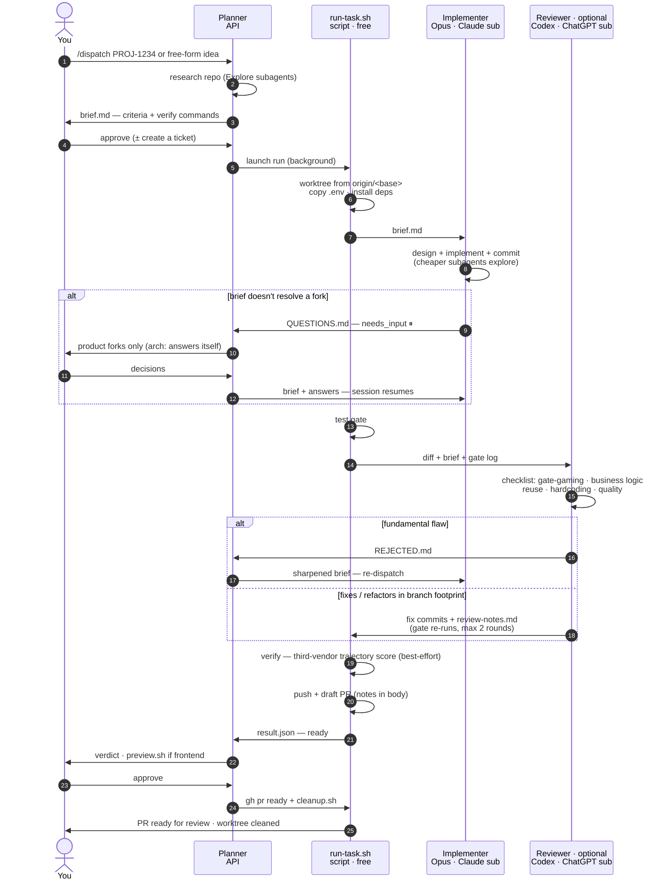

# Dispatch Harness

A multi-model pipeline for shipping code: **one model plans, a second
implements, a deterministic gate runs, a third — from a different vendor —
reviews and fixes, and a draft PR opens.** You approve at the ends; the middle
runs unattended in a git worktree.

The design principle is simple: **no model grades its own homework.** The agent
that writes the code is never the agent that reviews it, and they come from
different vendors (Anthropic and OpenAI), so a blind spot in one model's
training is unlikely to be shared by the other. Between them sits a gate no
model can talk its way past.

```
you → planner → [ implementer → gate → reviewer → gate ] → draft PR → you
  (your session)  (Claude sub)  (free)  (ChatGPT sub)
```

The planner isn't pinned by the harness: it is whatever Claude Code session
invokes `/dispatch`, billed however that session is billed — API credits or a
subscription. We've gotten the best results with **Claude Fable 5** as the
planner (sharper briefs up front mean fewer `needs_input` stops and review
fixes downstream); an Opus session on a Claude subscription also works, and
then the whole pipeline runs on flat-rate plans. Only the implementer and
reviewer are fixed by the pipeline. This page is the product; the manuals are
under [`docs/`](docs/) — [Operations](docs/operations.md) ·
[Reference](docs/reference.md) · [Ghost Shift](docs/wall.md) ·
[Design notes](docs/design-notes.md).

## Why it's built this way

**Cross-vendor implement/review split.** The implementer (Anthropic's Opus,
`claude-opus-5` by default) writes and commits; the reviewer (OpenAI's Codex,
`gpt-5.6-sol` by default) reads the diff cold and fixes what it finds. Neither
sees the other's reasoning — only the committed result. A self-review by the
same model rationalizes its own choices; a different lab's model does not.

**A deterministic gate between the models.** Between implement and review runs a
plain test gate — your repo's own `lint`/`type-check`/`test` commands, no model
in the loop. It is the objective checkpoint: green or red, no narrative. Because
a model *could* make the gate green by weakening the tests, the reviewer's
**first and highest-priority checklist item is anti-gate-gaming**: it hunts for
weakened or deleted tests, skipped cases, loosened assertions, hardcoded values
and edited fixtures, and restores proper tests instead. A green gate counts only
if the tests earning it weren't touched.

**The guarantee: every arm reviews or holds.** Cross-vendor is the preference;
a review is the requirement, and no path in `run-task.sh` opens a PR on a diff
nothing read. When Codex is out of credits, crashed or absent, the same review
prompt falls through to a second Codex account and then to a fresh Claude
session — never the implementer's own, so still a cold read — and the arm is
recorded (`claude_only`, `reviewed_claude`) rather than dressed up as
cross-vendor. If even that leaves no evidence the run ends `review_failed` with
`review: failed_silent` and pushes nothing. The one exception is an operator
asking for the unreviewed baseline on purpose (`HARNESS_SKIP_REVIEW=1`) — see [When Codex dies mid-run](docs/operations.md#when-codex-dies-mid-run-out-of-credits).

**Subscription economics.** The expensive, low-volume work — research and the
brief — runs in your orchestrator session. The expensive, *high-volume* work —
implementing and reviewing, which burn the most tokens — runs on flat-rate
**subscriptions** (Claude and ChatGPT) you already pay for, and the glue between
stages is deterministic shell that costs nothing. Frontier models on the
token-heavy stages, without metered token bills for them.

**`needs_input`: stop, don't guess.** When the implementer hits a fork the brief
doesn't resolve — a genuine product or priority decision — it does **not**
guess. It writes the specific question(s) to `QUESTIONS.md` and stops the run
with status `needs_input`. Worker sessions are **resumable**: append answers to
the brief, re-dispatch the same command, and the worker continues with its full
context intact rather than starting over. Per-model attribution works the same
way: `opus_head` records the boundary between the two models' commits in the
run's metadata, never in the commit messages
([the run directory](docs/reference.md#the-run-directory)).

## How a run goes



The same diagram, plus the monitoring one, is in [`FLOW.md`](FLOW.md), and a
printable one-page version in [`harness-flow.html`](harness-flow.html). Each run
gets its own git worktree (`<repo>-<ticket>`), so tickets run in parallel without
colliding, and everything the pipeline knows about a run — the brief, the
questions, the notes, the metrics — lives in a git-excluded `.harness/` directory
inside it that never ships in a commit or PR. When the real spec is an office
document the planner converts it to markdown and the harness mounts it at
`.harness/specs/` for both workers to read as part of the contract
([spec attachments](docs/reference.md#spec-attachments)). Without `codex`, the
same pipeline runs in [Claude-only mode](docs/operations.md#claude-only-mode).

## Quickstart

```bash
git clone <this-repo> dispatch-harness && cd dispatch-harness

# Symlinks the scripts into ~/.claude/harness and the skills into
# ~/.claude/skills/. Re-runnable, never clobbers local config, and offers to
# wire the live statusline into ~/.claude/settings.json.
./install.sh          # --copy for detached copies; --statusline / --no-statusline

# Pin a repo onto the pipeline (optional — anything unset is auto-detected).
~/.claude/harness/setup-repo.sh /path/to/repo            # preview the proposal
~/.claude/harness/setup-repo.sh /path/to/repo --write    # save it
$EDITOR ~/.claude/harness/notify.conf   # phone push / notifications (optional)
```

Then, from a Claude session in your orchestrator working directory,
`/dispatch <TICKET-or-"a description of what to build">`. The planner researches
the repo, writes a brief, and shows it for approval; on approval it launches
`run-task.sh <TICKET> <repo-path> <branch-name>` in the background.

**What you get.** A run ends one of three ways. `ready` — the gate is green, the
diff was reviewed, and a **draft PR** is open with the implementer's notes and
the reviewer's in its body. `needs_input` — the implementer stopped to ask;
answer in the brief and re-dispatch the same command. Anything else is an honest
failure named for its stage (`gate_failed`, `review_failed`, `capacity_failed`).
The pipeline never marks a PR ready and never merges.

A ticket that spans repos (an API change plus the screen that consumes it) fans
out into one run — and one PR — per repo, dispatched together; when every PR is
ready the planner puts the links on the ticket and moves it to In Review
([`skills/dispatch/SKILL.md`](skills/dispatch/SKILL.md) is the planner protocol).
For a ticket already written well enough to build from, `/briefed-dispatch
<TICKET>` skips the approval pause: the ticket *is* the approved artefact, so the
planner briefs every repo it touches, launches all runs immediately, and involves
you only for genuine product forks
([`skills/briefed-dispatch/SKILL.md`](skills/briefed-dispatch/SKILL.md)). Thin
tickets and free-form work stay with `/dispatch`, whose approval step is the
safety net that skill removes.

Three helpers cover the rest of a run's life: `attach.sh <RUN-ID>` steps into the
worker's live session with its context intact, `preview.sh <RUN-ID>` runs the dev
server in the worktree to see the change before approving, and
`cleanup.sh <RUN-ID>` promotes the run and removes the worktree.

## What else it does

**[Fire a run at a set time.](docs/operations.md#scheduling-a-run-for-later)**
`schedule.sh` arms a launchd one-shot from `run-task.sh`'s arguments and a time.
Honest about sleep: "08:10, or as soon as the machine wakes after that".

**[A run that defers itself instead of dying.](docs/operations.md#capacity-preflight-a-run-that-defers-itself)**
A dispatch into a spent subscription window is pure waste, so a run out of
capacity — at launch or mid-flight — re-arms *itself* for the block's reset.

**[A turn ceiling that resumes rather than kills.](docs/operations.md#turn-ceiling-a-run-that-resumes-itself)**
When the implementer exhausts `--max-turns` the run re-invokes the same pinned
session in the same worktree instead of failing.

**[Attempts counted, never overwritten.](docs/operations.md#attempts-a-run-is-a-ticket-an-attempt-is-a-dispatch)**
A run is a ticket; an attempt is a dispatch. Each attempt's telemetry is kept,
and a run that already reached `done: ready` refuses to be dispatched again.

**[Unused capacity spent on the night's queue.](docs/operations.md#the-quartermaster)**
`quartermaster.sh` decides at 19:00 which consented tickets to arm and how many,
from this machine's history of run costs. It only reports until you let it arm.

**[The PR lands on the ticket by itself.](docs/operations.md#ticket-sync)** A run
that reaches `ready` comments its draft-PR link on the ticket and moves it to In
Review — best-effort, never fatal.

**[Ambient monitoring.](docs/reference.md#monitoring-surfaces)** `statusline.sh`
puts a line per active run in every Claude session, `status.sh --watch` is the
zero-config live dashboard, and stage handoffs push to desktop and phone.

**[A wall for the room.](docs/wall.md)** `wall.sh` serves a read-only
city-at-night dashboard for an office TV: one tower per project, one climbing
car per run, and a district that accretes every PR the week shipped.

**[Runs from any machine.](docs/operations.md#runs-from-any-machine-harness_mirror)**
`HARNESS_MIRROR` mirrors a live run dir to another machine as it runs, so a
laptop's run shows on the office wall — and never blocks a run if that fails.

**[A stale PR branch re-merged.](docs/operations.md#re-merging-the-base-into-a-pushed-pr)** `sync-pr.sh`
re-merges the base into an already-pushed branch and hands the conflicts to the
same reviewer backend the run used, escalating rather than guessing.

**[A video in the PR body.](docs/operations.md#demo-recordings)** With demo
upload configured, a frontend run records the implementer's storyboard against
a dev server in the worktree and embeds it. Two more are under [Measuring](#measuring).

## Prerequisites

Required:

The **[`claude`](https://docs.claude.com/en/docs/claude-code) CLI** runs the
implementer (and optionally the planner) on a Claude subscription; **`gh`**
(authenticated) pushes branches and opens PRs; **`jq`** reads and writes run
metadata. Plus **`git`**, **`bash`**, `curl`, `perl`, `lsof` and `uuidgen` —
macOS ships all of them; on Linux, `uuid-runtime` and `lsof` may need adding.

Optional — one row per feature you can leave off; each is guarded, and its
absence costs exactly the feature named.

| Binary | What it enables | Where it is used |
| --- | --- | --- |
| `codex` (≥ 0.145) | The cross-vendor review stage, on a ChatGPT subscription. Older versions reject the default reviewer model. | Without it: [Claude-only mode](docs/operations.md#claude-only-mode) |
| `launchctl` | Arming a launchd agent — the one macOS-only flow in the harness. | [`schedule.sh`](docs/operations.md#scheduling-a-run-for-later), `quartermaster.sh --install` |
| `npx` (Node 20+) | Converting document attachments to markdown (`@firecrawl/anydoc`) and reading a station's local token accounting (`ccusage`). Nothing in the pipeline itself invokes it. | [Spec attachments](docs/reference.md#spec-attachments), [The Quartermaster](docs/operations.md#the-quartermaster) |
| `node` (≥ 20), `rsync`, `tmux` | The wall's zero-dependency HTTP server; copying a live run dir onto the machine that serves it (a remote target also needs `ssh` reaching the host non-interactively); and the parked orchestrator session you drive from your phone. | [Ghost Shift](docs/wall.md), [Runs from any machine](docs/operations.md#runs-from-any-machine-harness_mirror), `station.sh` |
| [`shot-scraper`](https://shot-scraper.datasette.io/), `ffmpeg`, [`rclone`](https://rclone.org/) | Recording the storyboard, transcoding it into a video plus preview GIF, and uploading both to any S3-compatible bucket. | [Demo recordings](docs/operations.md#demo-recordings) |
| `python3` (≥ 3.9, with `venv`) | `install.sh --verifier` builds a venv and installs the scoring library into it; it also runs the one-time login capture for demo recordings. Nothing else needs Python. | [The verifier](docs/reference.md#the-verifier) |
| `docker`, `nc`, `shellcheck` | The copyable Postgres preflight example, and this repo's own gate. | [`examples/`](examples/), [Development](#development) |

The verifier also needs a third-vendor credential for a backend that returns
logprobs — never Claude and never the two subscriptions the pipeline runs on.
Without both, the stage records one line and the run is exactly what it was.

Portability: the scripts target **bash 3.2** (the macOS default), and macOS
ships no `timeout(1)`, so a `perl -e 'alarm ...'` wrapper is the process cap.
Arming a launchd agent is the only macOS-only flow; `osascript`, used for
desktop notifications, is guarded, so on Linux those are skipped and phone push
via [ntfy](https://ntfy.sh) still works. CI runs the same gate on Linux
([`.github/workflows/gate.yml`](.github/workflows/gate.yml)) to keep the shipped
scripts portable.

## Configuration

**Pin a repo onto the pipeline.** `repos.conf.sh` (shipped) auto-detects defaults
for any repo: install and gate commands from the lockfile, base branch from the
remote. To pin one, add a `repo_config_local()` case arm to
`~/.claude/harness/repos.local.sh` (gitignored; `install.sh` seeds it), or let
[`setup-repo.sh`](docs/reference.md#generating-a-pin) write it for you —
`--verify` proves the commands pass in a throwaway worktree first. `GATE_CMD` is
the heart of it: the objective checkpoint both models are measured against, so
point it at the strictest fast feedback your repo has. `PREPROD=1` is the other
pin worth knowing up front — it tells both models the repo has no users yet, so
they remove obsolete paths instead of adding compatibility layers. Every field is
in [the repo pin](docs/reference.md#the-repo-pin).

**Local config files**, all gitignored and seeded from their `*.example` without
ever overwriting an existing copy: `repos.local.sh` for the pins above,
`notify.conf` for desktop and phone notifications, `demo.conf.sh` for the
demo-video storage remote. Two more are **not** seeded, because they are
credentials to create deliberately, mode 600: `linear-api-key` and
`verifier-api-key` ([Local config files](docs/reference.md#local-config-files)).

**Worker sandbox and MCP denies.** The implementer runs under
[`worker-settings.json`](worker-settings.json), which allow-lists the tools it
needs (edit/write, `npm`/`npx`/`yarn`/`node`/`uv`, read-only git, common shell
utilities) and **denies the ones that could do damage**: `git push`,
`git checkout`, `git switch` and `gh`. The harness owns pushing and PR creation;
the worker must never touch remotes or switch branches. This file governs the
Claude-side workers only — the Codex reviewer is bounded by its own sandbox and a
harness-owned `CODEX_HOME` carrying none of your rules ([What the reviewer is allowed to reach](docs/design-notes.md#what-the-reviewer-is-allowed-to-reach)).
If your worker loads an MCP server (via `MCP_CONFIG`) exposing destructive tools
— an environment switch, a deploy, a delete — **add those tool names to the
`deny` list in your installed copy**:

```jsonc
"deny": [
  "Bash(git push:*)",
  "Bash(git checkout:*)",
  "Bash(git switch:*)",
  "Bash(gh:*)",
  "mcp__your-db__switch_environment"
]
```

Deny lists are cheap insurance; add to them liberally.

## Security / threat model

This harness runs frontier models **unattended, with the ability to execute
code**, against your repositories. Be clear-eyed about what that means.

- **Arbitrary code execution is the design, not a bug.** The worker installs
  dependencies and runs your gate (`npm ci`, `npm test`, `uv run pytest`, …).
  Any of those can run arbitrary code — that is inherent to building and testing
  software. Only dispatch against repos you trust to build and test on your
  machine.
- **Prompt-injection surface.** Workers are allowed `WebFetch` and `WebSearch`,
  and they read repository contents and dependency code. Any of that text can
  contain instructions crafted to subvert the agent. For the Claude-side
  workers the deny list (`git push`/`checkout`/`switch`, `gh`, plus any
  destructive MCP tools you add) is the containment boundary: even a fully
  hijacked worker cannot push, switch branches, open/merge PRs, or hit a denied
  MCP tool. For the Codex reviewer that file does not apply at all — its
  boundary is the sandbox it runs in and the harness-owned `CODEX_HOME` that
  gives it no rules, plugins or MCP servers of yours, and no route off
  loopback. Either way the harness — not the model — owns every outward-facing
  action.
- **Deny-list philosophy.** Allow the worker the minimum it needs to implement
  and self-check; deny anything that reaches outside the worktree or is
  irreversible. When in doubt, deny — a blocked tool call surfaces as a prompt,
  a missed one can push to production. Review `worker-settings.json` before
  first use and extend its `deny` list for your environment.
- **Keep secrets out of briefs and worktrees.** The brief and the diff are
  handed to two different vendors' models and end up in a PR body. Do not paste
  credentials, tokens, or private URLs into a brief. Real `.env` files are
  copied into the worktree so the gate can run, but they are gitignored and must
  never be committed — the harness strips any `.harness/` metadata that slips
  into the index as a backstop, but treat secret hygiene as your responsibility.
- **Local only.** Database and MCP tools operate against your **local**
  environment. The worker is instructed never to switch environments or touch
  staging/production, and destructive environment-switch tools should be denied
  outright (see above).

## Measuring

Every run writes a `result.json`: the arm, the pinned models and efforts, gate
rounds, commit counts either side of `opus_head`, diff size, turns, tokens and
wall time. `metrics.sh` tabulates those across all runs (`--csv` for stats
tools), and `metrics.sh --report` turns them into the pipeline's own vitals —
which round the gate fails, what a run costs, how many diffs went unreviewed
([schema](docs/reference.md#metrics-schema), [how to read it](docs/design-notes.md#reading-the-pipelines-own-vitals)).

None of that says how *well* a run satisfied its brief, so after the review stage
a third vendor scores the run's whole trajectory — the implementer's steps, the
gate rounds, the reviewer's notes, the observed end state — as a number in
[0, 1], overall and per acceptance criterion.
**It is advisory, and it never gates.** Nothing in the pipeline branches on it;
a verifier that is off, unkeyed or broken leaves the run byte-for-byte what it
would have been. Turning it on: [The verifier](docs/reference.md#the-verifier).

Two knobs turn a normal run into a controlled ablation arm —
`HARNESS_SKIP_REVIEW=1` for no review, `IMPLEMENTER_MODEL` for a different
implementer — which is what [`bench/DESIGN.md`](bench/DESIGN.md) builds on: a
paired comparison on 100 SWE-bench Verified instances, analysed with McNemar's
test.

## Repository layout

| Path | What it is |
| --- | --- |
| `run-task.sh` `sync-pr.sh` | The pipeline (worktree → implement → gate → review → PR), and [the base re-merge](docs/operations.md#re-merging-the-base-into-a-pushed-pr) for an already-pushed branch |
| `schedule.sh` `capacity.sh` `quartermaster.sh` | [Fire a prepared run at a set time](docs/operations.md#scheduling-a-run-for-later), the local-file subscription accounting the [preflight](docs/operations.md#capacity-preflight-a-run-that-defers-itself) defers on, and [the 19:00 check](docs/operations.md#the-quartermaster) that fills the night with briefed work |
| `repos.conf.sh` `setup-repo.sh` | Generic per-repo detection (sourcing your `repos.local.sh`), and the inspector that proposes or writes a repo's pinned entry |
| `statusline.sh` `status.sh` `attach.sh` `preview.sh` `cleanup.sh` `station.sh` | Live run lines for the Claude Code statusline (`--runs-only` to compose), the terminal monitor (`status.sh --watch` is the live dashboard), and the lifecycle helpers |
| `wall.sh` `wall/` `.creative/` `mirror.sh` | [Ghost Shift](docs/wall.md): the big-screen dashboard (node server, one static page, fixtures), the art-direction contract it is graded against, and `HARNESS_MIRROR`'s run-dir copier |
| `metrics.sh` `verify.py` | Per-run metrics from `result.json` (table / `--csv`) plus the [aggregate health report](docs/design-notes.md#reading-the-pipelines-own-vitals) (`--report`), and [the verifier](docs/reference.md#the-verifier) that scores a run's trajectory (`--dry-run` needs no library and no key) |
| `worker-settings.json` `planner-settings.json` `setup-ai-settings.json` | The implementer's tool allow/deny list, and the read-only sandboxes for the quartermaster's self-briefing planner and `setup-repo.sh --ai` |
| `brief-template.md` `skills/dispatch/SKILL.md` `skills/briefed-dispatch/SKILL.md` | The per-task contract, and the planner protocol with and without the approval pause |
| `install.sh` `notify.conf.example` `demo.conf.sh.example` `repos.local.sh.example` `demo-auth.sh` `auth-capture.py` | Idempotent installer, the templates it seeds your local config from, and the one-time login capture for demo recordings |
| `gate.sh` `tests/` `.github/workflows/gate.yml` | This repo's own gate (`shellcheck` + `bash -n`, then every suite) and the same gate on Linux CI |
| `docs/` `bench/DESIGN.md` `examples/` | [Operations](docs/operations.md) · [Reference](docs/reference.md) · [Ghost Shift](docs/wall.md) · [Design notes](docs/design-notes.md), the benchmark design, and copyable templates |
| `README.md` `FLOW.md` `harness-flow.html` `RELEASING.md` `LICENSE` `.gitignore` `.gitattributes` | This front page, the pipeline diagrams, the publication checklist, the license, and Git metadata |

## Development

This repo's own test gate is [`gate.sh`](gate.sh): `bash -n` and
`shellcheck -x -S warning` over every shipped script, then every suite in
`tests/*.test.sh`. Run it before committing, or run one suite standalone — they
are self-contained bash: no framework, no network, no writes outside a temp
sandbox. CI runs the same gate on Linux for every push and pull request.

```bash
bash gate.sh
bash tests/docs.test.sh
```

`tests/docs.test.sh` is the docs-as-tests suite: the Prerequisites above name
every binary the scripts need, `install.sh`'s file list matches the repo, every
knob `run-task.sh` honors is documented here or under `docs/`, and no script,
link or promise named in either has stopped existing.

## License

[MIT](LICENSE) © 2026 Angel Sole
