# Dispatch Harness

A local-first harness for delegated coding tasks: a planner writes the brief,
a worker implements in an isolated worktree, deterministic checks run, an
independent session reviews the result, and the harness can open a draft PR.
The conversation can close while the task runs. Completed work and recovery
state live on disk.

Use your laptop by default. The Mini is an optional execution host and a place
to keep shared stations under explicitly selected teammates' saved accounts.
Independent review provides another check on the change; it does not guarantee
that a different model or vendor will catch every defect.

```
you → planner → [ implementer → gate → reviewer → gate ] → draft PR → you
  (your session)  (Claude sub)  (free)  (ChatGPT sub)
```

The planner is the calling Codex or Claude Code session, billed however that
session is billed. The station launcher defaults to **GPT-6 Astra in Codex**;
the implementer and reviewer keep their own model pins. Why it is built this way is in
[Design notes](docs/design-notes.md); the rest of the manuals are indexed
[below](#the-manuals).

## Quickstart

Install once on each machine where you want to run the harness. Existing
provider logins are reused. Copied installs stay fixed until you update them;
`--symlink` is available for developing the harness itself.

```bash
git clone <this-repo> dispatch-harness && cd dispatch-harness
./install.sh --copy --no-statusline

cd /path/to/project
dispatch                         # local Astra planner; no tmux or SSH
dispatch "Fix the checkout test"  # start the planner with a task
dispatch "Fix checkout" --no-publish # keep the reviewed result local
dispatch init                    # detect and save this repo's settings
```

The installer adds `~/.local/bin/dispatch`. If that directory is not on PATH,
use the printed absolute command. In an existing Codex conversation use
`$dispatch`; in Claude Code use `/dispatch`.

**Choose your orchestrator each time.** Both use the same harness:

```bash
dispatch --planner codex                 # Astra in Codex (the default)
dispatch --planner claude --model fable  # Fable in Claude Code
```

With `--planner claude`, omitting `--model` uses that account's configured
Claude model. These commands open separate conversations; conversation history
stays in its original CLI. Both planners can inspect saved harness runs with
`dispatch status`. The choice controls the planner; implementation and review
follow the repository's settings.

For hands-off orchestration, add `--hands-off`:

```bash
dispatch --hands-off "Fix the checkout error when the cart is empty"
dispatch --planner claude --model fable --hands-off "Fix the checkout error when the cart is empty"
```

This skips the planner's tool permission prompts. It passes
`--dangerously-skip-permissions` to Claude Code and
`--dangerously-bypass-approvals-and-sandbox` to Codex, including disabling the
Codex sandbox. The choice applies to this launch; without the flag, the planner
uses its existing CLI settings. Workers and reviewers keep the harness's task
permissions and gates. Essential missing information and account sign-in can
still require your input.

Opening a planner checks only its own login. Task implementation currently
uses the Claude CLI (Anthropic or the repo's pinned z.ai provider); Codex adds
the independent review, with a fresh Claude reviewer as the fallback.
GitHub authentication is checked when a publishing run reaches the PR step.
Trackers, scheduling, the wall, and visual stages are optional.

The planner submits a brief through the same interface available to scripts:

```bash
dispatch run --brief /path/to/brief.md --json
dispatch run --brief /path/to/brief.md --no-publish # reviewed local branch
dispatch status
dispatch wait <RUN-ID> --timeout 60 --json
dispatch resume <RUN-ID>
```

`run` generates the ID and branch unless `--id` / `--branch` specify them. The
runner detaches automatically. `resume` reports live/finished runs without
launching them again; stopped runs reuse valid checkpoints. A missing login
leaves the task saved with a concrete repair action. See
[Local tasks and recovery](docs/operations.md#local-tasks-and-recovery).

**Mini stations and holiday coverage.** Keep teammates' saved accounts on the
Mini and explicitly choose the station whose account should run the work:

```bash
dispatch stations --on mini
dispatch station --on mini --owner teammate --planner codex
dispatch station --on mini --owner teammate --planner claude --model fable
```

Add `--dir /path/to/repos` to choose the remote working directory. Each
account, planner, and model has a separate persistent station; repeat its
command to reconnect. Tasks launched there use the selected account.
Add `--hands-off` to a station command for the same permission bypass on the
Mini. Hands-off stations have separate sessions from ordinary stations; repeat
the flag when reconnecting.
Selection includes that profile's Codex, Claude, and GitHub
configuration, so its GitHub identity is used for PR operations too. Account
selection is recorded on the run and retained on resume. There is no automatic
rotation through other teammates' accounts. If a saved login expires, its
account holder renews it. Login status does not measure remaining credits.

A laptop planner can also submit a prepared task remotely without opening an
interactive station:

```bash
dispatch run --on mini --owner teammate --repo /remote/path/to/project \
  --brief /local/path/to/brief.md
dispatch status --on mini
```

Teammates using only the Mini need no laptop installation. With SSH access,
they can connect directly to an existing station:

```bash
ssh -t mini '~/.claude/harness/station.sh --owner teammate'
```

The Mini has one shared harness installation. The operator updates it once;
station users do not re-run `install.sh`. First-time personal login setup is
`station.sh setup --owner you`; see
[Station setup and login repair](docs/operations.md#station-setup-and-login-repair).

**Watching it.** `statusline.sh` puts a line per active run in every Claude
session on the machine, and `status.sh --watch` is the same picture as a
zero-config live dashboard in any terminal. Three helpers cover the rest of a
run's life: `attach.sh <RUN-ID>` steps into the worker's live session with its
context intact, `preview.sh <RUN-ID>` runs the dev server in the worktree to see
the change before approving, and `cleanup.sh <RUN-ID>` promotes the run and
removes the worktree.

**What you get.** A run ends one of three ways. `ready` — the gate is green, the
diff was reviewed, and a **draft PR** is open with the implementer's notes and
the reviewer's in its body. `needs_input` — the implementer stopped to ask;
answer in the brief and re-dispatch the same command. Anything else is an honest
failure named for its stage (`gate_failed`, `review_failed`, `capacity_failed`).
Underneath sits the guarantee that **every arm reviews or holds**: no path opens
a PR on a diff nothing read, a review that falls back to a same-vendor cold read
is recorded as `claude_only` rather than dressed up as cross-vendor, and a run
that could get no review at all ends `review_failed` with
`review: failed_silent` and pushes nothing. The pipeline never marks a PR ready
and never merges.

**More repos, and tickets that need no approval.** A ticket that spans repos (an
API change plus the screen that consumes it) fans out into one run — and one PR
— per repo, dispatched together
([`skills/dispatch/SKILL.md`](skills/dispatch/SKILL.md) is the planner
protocol). For a ticket already written well enough to build from,
`/briefed-dispatch <TICKET>` skips the approval pause and involves you only for
genuine product forks
([`skills/briefed-dispatch/SKILL.md`](skills/briefed-dispatch/SKILL.md)); thin
tickets and free-form work stay with `/dispatch`, whose approval step is the
safety net that skill removes.

## How a run goes

```mermaid
flowchart LR
    U(["👤 You<br/>/dispatch a ticket or a description"])
    B["📝 Brief<br/>acceptance criteria + verify commands<br/>you approve it"]
    I["🤖 Implementer<br/>Claude, alone in a fresh git worktree"]
    G{"✅ Deterministic gate<br/>your repo's lint · types · tests<br/>no model in the loop"}
    P["📬 Draft PR<br/>both models' notes in the body"]
    M(["🎉 You merge<br/>the pipeline never does"])

    subgraph REV ["🔎 Review — three passes, never the model that wrote the code"]
        direction LR
        F["🔍 Find<br/>a different vendor reads the diff cold<br/>reports, fixes nothing"]
        R["⚖️ Refute<br/>a fresh session tries to disprove every finding"]
        X["🔧 Fix<br/>survivors only, one commit per finding"]
        F --> R --> X
    end

    U --> B --> I --> G
    G -->|"green"| F
    G -->|"red — back to the implementer"| I
    I -.->|"a fork the brief didn't answer"| U
    X --> P --> M

    N["📎 A refutation only counts if it cites code<br/>the harness verifies byte-for-byte"]
    R -.- N

    classDef you fill:#c9d6e4,stroke:#54677d,color:#1a1a1a
    classDef implementer fill:#d9cfe9,stroke:#6f5f92,color:#1a1a1a
    classDef reviewer fill:#f2d9c0,stroke:#a5764a,color:#1a1a1a
    classDef script fill:#c8ddc9,stroke:#4f7f5b,color:#1a1a1a
    classDef callout fill:#efe4c2,stroke:#96814a,color:#1a1a1a
    class U,B,M you
    class I implementer
    class F,R,X reviewer
    class G,P script
    class N callout
```



The same pipeline stage by stage — every branch, plus the two optional stages
this one leaves out — is the sequence diagram in [`FLOW.md`](FLOW.md), next to
the monitoring one; a printable one-page version is in
[`harness-flow.html`](harness-flow.html). Each run gets its own git worktree
(`<repo>-<ticket>`), so tickets run in parallel without colliding, and
everything the pipeline knows about a run — the brief, the questions, the notes,
the metrics — lives in a git-excluded `.harness/` directory inside it that never
ships in a commit or PR
([the run directory](docs/reference.md#the-run-directory)).

## Prerequisites

Required:

For the `dispatch` interface: **`python3` (≥ 3.9)** and the selected planner
CLI. No third-party Python packages are needed.

For task execution, the **[`claude`](https://docs.claude.com/en/docs/claude-code) CLI** runs the
implementer (and optionally the planner) on a Claude subscription; **`gh`**
(authenticated at publication time) opens PRs; `--no-publish` needs no GitHub login; **`jq`** reads and writes run
metadata. Plus **`git`**, **`bash`**, `curl`, `perl`, `lsof` and `uuidgen` —
macOS ships all of them; on Linux, `uuid-runtime` and `lsof` may need adding.

Optional — one row per feature you can leave off; each is guarded, and its
absence costs exactly the feature named.

| Binary | What it enables | Where it is used |
| --- | --- | --- |
| `codex` (≥ 0.145) | The cross-vendor review stage, on a ChatGPT subscription. Older versions reject the default reviewer model. | Without it: [Claude-only mode](docs/operations.md#claude-only-mode) |
| `launchctl` | Arming a launchd agent — the one macOS-only flow in the harness. | [`schedule.sh`](docs/operations.md#scheduling-a-run-for-later), `quartermaster.sh --install` |
| `npx` (Node 20+) | Converting document attachments to markdown (`@firecrawl/anydoc`) and reading a station's local token accounting (`ccusage`). Nothing in the pipeline itself invokes it. | [Spec attachments](docs/reference.md#spec-attachments), [The Quartermaster](docs/operations.md#the-quartermaster) |
| `node` (≥ 20), `rsync`, `tmux`, `tailscale` | The wall's zero-dependency HTTP server; copying a live run dir onto the machine that serves it (a remote target also needs `ssh` reaching the host non-interactively); the parked orchestrator session you drive from your phone; and `wall.sh --init-token`, which advertises the wall on its Tailscale address (falls back to the hostname without it). | [Ghost Shift](docs/wall.md), [Runs from any machine](docs/operations.md#runs-from-any-machine-harness_mirror), `station.sh` |
| [`shot-scraper`](https://shot-scraper.datasette.io/), `ffmpeg`, [`rclone`](https://rclone.org/) | Recording the storyboard, transcoding it into a video plus preview GIF, and uploading both to any S3-compatible bucket. | [Demo recordings](docs/operations.md#demo-recordings) |
| `python3` (≥ 3.9, with `venv`) | `install.sh --verifier` builds a venv and installs the scoring library into it; it also runs the one-time login capture for demo recordings. The `dispatch` interface and checkpoint recovery use Python without third-party packages. | [The verifier](docs/reference.md#the-verifier) |
| `docker`, `nc`, `shellcheck` | The copyable Postgres preflight example, and this repo's own gate. | [`examples/`](examples/), [Development](docs/development.md) |
| `npm` / `yarn` / `uv`, whichever your repo uses | Nothing in the harness itself: they are your repo's own `INSTALL_CMD` and `GATE_CMD`, auto-detected from its lockfile and allow-listed for the worker. | [The repo pin](docs/reference.md#the-repo-pin) |
| `oxlint` / `ruff` (or `npx` / `uvx` to fetch one) | The `QUALITY_GATE` pin's static checks — JS/TS on oxlint, Python on ruff. A missing tool costs a disclosed `skip` line for that language, never the run. | [The quality bar](docs/reference.md#quality_gate-the-quality-bar) |
| `magick` (ImageMagick 7), plus `shot-scraper`'s Playwright and `python3` with `numpy`/`Pillow` | The visual profile's contact sheet, its headless render and its model-free frame checks. Only a repo the profile applies to needs any of them. | [Profiles](docs/reference.md#profiles) |

The verifier also needs a third-vendor credential — never Claude and never the
two subscriptions the pipeline runs on, because no model grades its own
homework. Without both, the stage records one line and the run is exactly what
it was.

Portability: the scripts target **bash 3.2** (the macOS default), and macOS
ships no `timeout(1)`, so a `perl -e 'alarm ...'` wrapper is the process cap.
Arming a launchd agent is the only macOS-only flow; `osascript`, used for
desktop notifications, is guarded, so on Linux those are skipped and phone push
via [ntfy](https://ntfy.sh) still works. CI runs the same gate on Linux
([`.github/workflows/gate.yml`](.github/workflows/gate.yml)) to keep the shipped
scripts portable.

## The manuals

This page is the front door; everything else lives under [`docs/`](docs/).

| Page | What it covers |
| --- | --- |
| [Operations](docs/operations.md) | Running the harness when nobody is at the desk: scheduling, capacity deferral, attempts, the Quartermaster, the janitor, ticket sync, mirroring, Claude-only mode, and what the review stage does when a reviewer dies mid-run |
| [Reference](docs/reference.md) | Every environment variable and repo-pin field, the review stage's three passes, profiles, the verifier, the run directory and the metrics schema |
| [Design notes](docs/design-notes.md) | Why it is built this way, the incidents behind the self-recovery rules, and how to read the pipeline's own vitals |
| [Decision log](docs/adr/README.md) | The architecture decisions behind the pipeline, dated and one per file: why no model grades its own homework, why findings must survive refutation, why the verifier never gates, and what each of those costs |
| [Trust me, said the reviewer](docs/verified-grounding.md) | Why refutations must cite repository code that the harness verifies byte-for-byte |
| [Security](docs/security.md) | The threat model of an unattended, code-executing pipeline, and the deny list that bounds the worker |
| [Development](docs/development.md) | This repo's own gate, its suites (`tests/*.test.sh`), and the docs-as-tests pass that keeps these pages honest |
| [Ghost Shift](docs/wall.md) | The big-screen wall: the city, the district, the ledger and the ops console |
| [The wall's data contract](docs/wall-contract.md) | Which run-dir files the wall reads, and how much half-written-ness each one tolerates |

And one line per thing the pipeline does beyond implement → gate → review:

| What it does | Where it is documented |
| --- | --- |
| `schedule.sh` arms a launchd one-shot from `run-task.sh`'s arguments and a time. Honest about sleep: "08:10, or as soon as the machine wakes after that" | [Scheduling a run for later](docs/operations.md#scheduling-a-run-for-later) |
| A dispatch into a spent subscription window is pure waste, so a run out of capacity — at launch or mid-flight — re-arms *itself* for the block's reset | [Capacity preflight](docs/operations.md#capacity-preflight-a-run-that-defers-itself) |
| When the implementer exhausts `--max-turns` the run re-invokes the same pinned session in the same worktree instead of failing | [Turn ceiling](docs/operations.md#turn-ceiling-a-run-that-resumes-itself) |
| A run is a ticket; an attempt is a dispatch. Each attempt's telemetry is kept, and a run that already reached `done: ready` refuses to be dispatched again | [Attempts](docs/operations.md#attempts-a-run-is-a-ticket-an-attempt-is-a-dispatch) |
| `quartermaster.sh` decides at 19:00 which consented tickets to arm and how many, from this machine's history of run costs. It only reports until you let it arm | [The Quartermaster](docs/operations.md#the-quartermaster) |
| `janitor.sh` removes exactly the worktrees whose PR is merged and whose tree is clean — the ones `cleanup.sh` never got to. An open PR, a dirty tree, a run still going, or a PR state it could not read is named and left alone, and run logs are never deleted | [The Janitor](docs/operations.md#the-janitor) |
| A run that reaches `ready` comments its draft-PR link on the ticket and moves it to In Review — best-effort, never fatal | [Ticket sync](docs/operations.md#ticket-sync) |
| Ambient monitoring: the statusline, `status.sh --watch`, and a desktop and phone push on every stage handoff | [Monitoring surfaces](docs/reference.md#monitoring-surfaces) |
| `wall.sh` serves a read-only city-at-night dashboard for an office TV: one tower per project, one climbing car per run, and a district that accretes every PR the week shipped | [Ghost Shift](docs/wall.md) |
| `HARNESS_MIRROR` mirrors a live run dir to another machine as it runs, so a laptop's run shows on the office wall — and never blocks a run if that fails | [Runs from any machine](docs/operations.md#runs-from-any-machine-harness_mirror) |
| `sync-pr.sh` re-merges the base into an already-pushed branch and hands the conflicts to the same reviewer backend the run used, escalating rather than guessing | [Re-merging the base into a pushed PR](docs/operations.md#re-merging-the-base-into-a-pushed-pr) |
| Eyes, for work judged by eye: on a repo carrying an art-direction contract in `.creative/`, a visual gate renders fixed shots, measures them, and asks a blind critic — twice, with the images swapped — whether this beats the reigning champion. `/dispatch-pixel` is its planner protocol; on every other repo not one line of it runs | [Profiles](docs/reference.md#profiles) · [the six extension points](docs/design-notes.md#the-extension-points-and-why-there-are-exactly-six) |
| A video in the PR body: with demo upload configured, a frontend run records the implementer's storyboard against a dev server in the worktree and embeds it | [Demo recordings](docs/operations.md#demo-recordings) |
| When the real spec is an office document the planner converts it to markdown and the harness mounts it at `.harness/specs/` for both workers to read as part of the contract | [Spec attachments](docs/reference.md#spec-attachments) |
| Pinning a repo onto the pipeline: `GATE_CMD` (the checkpoint both models are measured against), `PREPROD`, `QUALITY_GATE` (a machine-checked quality bar on the files each branch touches), and the local config files `install.sh` seeds | [The repo pin](docs/reference.md#the-repo-pin) · [Local config files](docs/reference.md#local-config-files) |
| What the worker may reach, what its `deny` list refuses, and what to add to it when your MCP server exposes a destructive tool | [Security](docs/security.md) |
| Every run writes a `result.json`; `metrics.sh` tabulates them and `metrics.sh --report` turns them into the pipeline's own vitals — which round the gate fails, what a run costs, how many diffs went unreviewed | [Metrics](docs/reference.md#metrics) · [how to read it](docs/design-notes.md#reading-the-pipelines-own-vitals) |
| After the review stage a third vendor scores the finished change against a fixed five-item rubric, every answer quoting the line that decides it. **It is advisory, and it never gates.** | [The verifier](docs/reference.md#the-verifier) |
| Two knobs turn a normal run into a controlled ablation arm — `HARNESS_SKIP_REVIEW=1` for no review, `IMPLEMENTER_MODEL` for a different implementer — which is what the paired SWE-bench comparison builds on | [Ablation knobs](docs/reference.md#ablation-knobs) · [`bench/DESIGN.md`](bench/DESIGN.md) |

## Repository layout

| Path | What it is |
| --- | --- |
| `run-task.sh` `sync-pr.sh` | The pipeline (worktree → implement → gate → review → PR), and [the base re-merge](docs/operations.md#re-merging-the-base-into-a-pushed-pr) for an already-pushed branch |
| `schedule.sh` `capacity.sh` `quartermaster.sh` | [Fire a prepared run at a set time](docs/operations.md#scheduling-a-run-for-later), the local-file subscription accounting the [preflight](docs/operations.md#capacity-preflight-a-run-that-defers-itself) defers on, and [the 19:00 check](docs/operations.md#the-quartermaster) that fills the night with briefed work |
| `repos.conf.sh` `setup-repo.sh` | Generic per-repo detection (sourcing your `repos.local.sh`), and the inspector that proposes or writes a repo's pinned entry |
| `dispatch.sh` | The local-first command interface: planner, task submission, status, checkpoint recovery, and remote stations |
| `lib/common.sh` | The plumbing every script shares, sourced from beside it: `HARNESS_DIR`, the macOS-safe timeout cap, the `--help` that reads a script's own header comment, the run's worktree and pinned knobs, and the Codex-availability preamble |
| `lib/profile.sh` `profiles/` | [The pipeline's six named extension points](docs/design-notes.md#the-extension-points-and-why-there-are-exactly-six) and the loader that fills them per repo, plus the one profile that ships: [`profiles/visual/`](profiles/visual/creative/README.md), the visual gate, the blind critic and the asset factories |
| `statusline.sh` `status.sh` `attach.sh` `preview.sh` `cleanup.sh` `janitor.sh` `station.sh` | Live run lines for the Claude Code statusline (`--runs-only` to compose), the terminal monitor (`status.sh --watch` is the live dashboard), and the lifecycle helpers — including [the janitor](docs/operations.md#the-janitor), the pass that sweeps the worktrees `cleanup.sh` never got to |
| `wall.sh` `wall/` `.creative/` `mirror.sh` | [Ghost Shift](docs/wall.md): the big-screen dashboard (node server, one static page, fixtures), the art-direction contract it is graded against, and `HARNESS_MIRROR`'s run-dir copier |
| `metrics.sh` `verify.py` | Per-run metrics from `result.json` (table / `--csv`) plus the [aggregate health report](docs/design-notes.md#reading-the-pipelines-own-vitals) (`--report`), and [the verifier](docs/reference.md#the-verifier) that scores a run's trajectory (`--dry-run` needs no library and no key) |
| `lessons.sh` `lib/lessons.sh` | [The feedback loop](docs/reference.md#the-feedback-loop): the review findings that survived refutation, ranked by recurrence and by what their PR cost after merge, distilled per repo and read back by the next run's planner and implementer |
| `worker-settings.json` `planner-settings.json` `spec-critic-settings.json` `setup-ai-settings.json` | The implementer's tool allow/deny list, and the read-only sandboxes for the quartermaster's self-briefing planner, [the spec critic](docs/reference.md#the-spec-critic) and `setup-repo.sh --ai` |
| `brief-template.md` `spec-critic.sh` `skills/dispatch/SKILL.md` `skills/briefed-dispatch/SKILL.md` `skills/dispatch-pixel/SKILL.md` | The per-task contract and [the confined pass that attacks it](docs/reference.md#the-spec-critic) before dispatch, the planner protocol with and without the approval pause, and the art-director protocol for visual work (`install.sh --pixel`) |
| `install.sh` `notify.conf.example` `demo.conf.sh.example` `repos.local.sh.example` `demo-auth.sh` `auth-capture.py` | Idempotent installer, the templates it seeds your local config from, and the one-time login capture for demo recordings |
| `gate.sh` `tests/` `.github/workflows/gate.yml` | This repo's own gate (`shellcheck` + `bash -n`, then every suite) and the same gate on Linux CI |
| `docs/` `docs/adr/` `bench/DESIGN.md` `examples/` | [Operations](docs/operations.md) · [Reference](docs/reference.md) · [Ghost Shift](docs/wall.md) · [The wall's data contract](docs/wall-contract.md) · [Design notes](docs/design-notes.md), the [decision log](docs/adr/README.md) that dates the choices behind them, the benchmark design, and copyable templates |
| `README.md` `FLOW.md` `harness-flow.html` `RELEASING.md` `LICENSE` `.gitignore` `.gitattributes` | This front page, the pipeline diagrams, the publication checklist, the license, and Git metadata |

## License

[MIT](LICENSE) © 2026 Angel Sole
